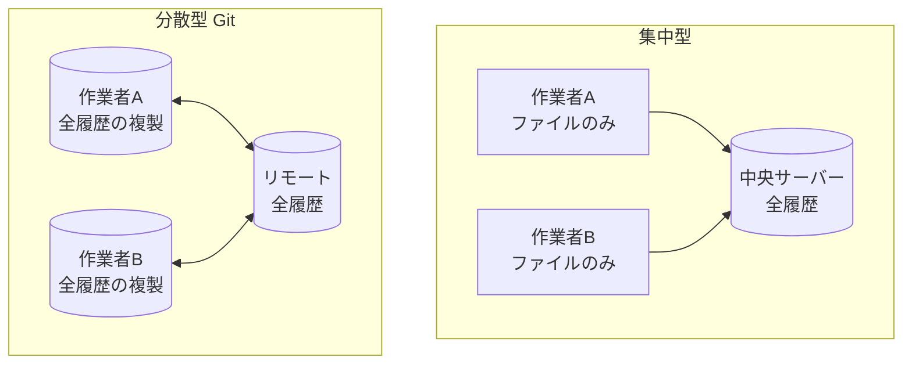

# 集中型と分散型、そして Git

## このセクションで学ぶこと

- 集中型バージョン管理の仕組みと弱点
- 分散型バージョン管理の特徴
- Git が分散型であることの実務上の利点

## 集中型: 中央サーバーがすべてを持つ

バージョン管理システムには大きく 2 つの方式があります。1 つめは**集中型バージョン管理**です。履歴はすべて中央サーバーに集約され、利用者は作業に必要なファイルだけをサーバーから取り出します。Subversion(SVN)が代表例です。

考え方はシンプルですが、弱点があります。サーバーに接続できないと履歴の確認やコミットができず、サーバーが故障して履歴が失われると全員が困ります。中央が単一障害点になりやすいのです。

## 分散型: 全員が完全な複製を持つ

2 つめが**分散型バージョン管理**で、**Git** はこちらに属します。利用者は中央リポジトリを**クローン**し、履歴を含む完全な複製を手元に持ちます。

## Git が分散型であることの利点

手元に履歴があることで、次のような実務上の利点が生まれます。

- **オフラインで作業できる**: コミットや履歴閲覧はネットワーク不要です。たとえば飛行機での移動中や電波の届かない場所でも、いつもどおりコミットを積み重ね、後でネットワークにつながったときにまとめて共有できます。
- **動作が速い**: 履歴がローカルにあるため、ほとんどの操作がディスクアクセスだけで完結します。過去のコミットとの差分表示や履歴の検索でサーバーの応答を待つことがなく、ストレスなく作業できます。
- **壊れにくい**: 各人の複製が事実上のバックアップを兼ねます。仮に中央のリモートが消えても、誰か 1 人の手元の複製から履歴ごと復元できるため、データを完全に失うリスクが小さくなります。

ここで注意したいのは、GitHub などの「リモート」も役割上の中心にすぎず、技術的には数ある複製の 1 つだという点です。チームでは「ここを正とする」という約束で 1 つのリモートを共有の窓口に決めているだけで、Git の仕組みとしては各人の複製と対等です。次のセクションでは、その 1 つの複製の内部、リポジトリの構造を見ていきます。

## まとめ

- 集中型は中央サーバーに履歴を集約し、単一障害点になりやすい
- 分散型(Git)は各自が履歴ごと複製を持つ
- オフライン作業・高速・壊れにくさが分散型の主な利点
