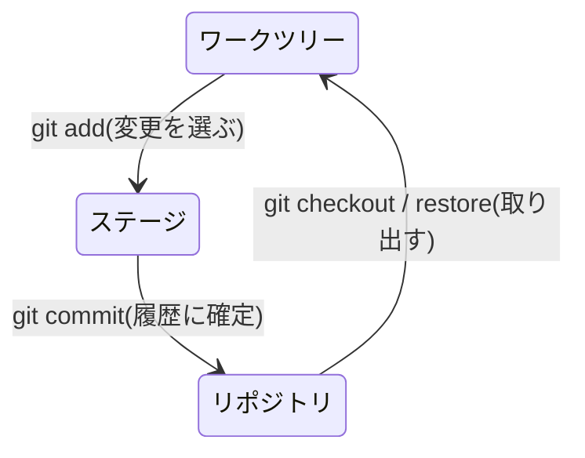

# リポジトリ・コミット・ワークツリー

## このセクションで学ぶこと

- リポジトリとコミットの関係
- ワークツリー・ステージ・リポジトリの 3 つの領域
- 変更がコミットされるまでの流れ

## リポジトリとコミット

**リポジトリ**は、プロジェクトのファイルと全変更履歴を格納する保管庫です。その実体は、プロジェクトの先頭に置かれる `.git` という隠しディレクトリです。

履歴は**コミット**という単位の連なりでできています。1 つのコミットは、その時点のプロジェクト全体の**スナップショット**(瞬間の状態)と、「誰が・いつ・何を・なぜ変えたか」というメタ情報を持ちます。コミットは前のコミットを指し示すため、履歴は数珠つなぎの鎖のようになります。

## 3 つの領域

Git で変更を記録するとき、ファイルは 3 つの領域を移動します。

- **ワークツリー**: 実際に編集している作業ディレクトリ。エディタで開いているファイルそのものです。
- **ステージ**(インデックス): 次のコミットに含める変更を一時的に集める中間領域。
- **リポジトリ**: コミットとして履歴に確定された状態の保管場所。



## なぜステージがあるのか

「編集したら即コミット」ではなく、間にステージを挟むのには理由があります。1 回の作業で複数の変更をしても、関連する変更だけをステージに選んで、意味のある単位でコミットを分けられるからです。

たとえばバグ修正とタイプミス修正を同時にしたとき、次のように関連するファイルだけをステージに選んで、別々のコミットにできます。

```bash
git add bugfix.js          # バグ修正だけをステージへ
git commit -m "ログイン時のエラーを修正"
git add README.md          # 次にタイプミス修正をステージへ
git commit -m "READMEの誤字を修正"
```

このように、1 回の作業をそのまま 1 コミットにするのではなく、意味のある単位に切り分けられます。後から履歴を読む人にとって、1 コミット = 1 つの意図、という状態は非常に追いやすくなります。この「変更を選んでから確定する」二段構えが Git の柔軟さの源です。

## まとめ

- リポジトリは全履歴を持つ保管庫で、実体は .git ディレクトリ
- 履歴はスナップショットであるコミットの連なりでできている
- 変更はワークツリー → ステージ → リポジトリの順に進み、ステージが意味のある単位での記録を可能にする
