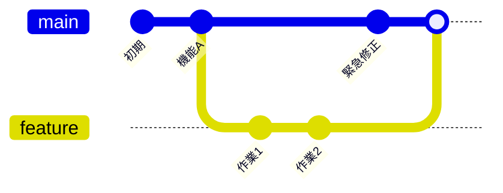

# ブランチという考え方

## このセクションで学ぶこと

- ブランチが何のためにあるか
- ブランチの作成と切り替え
- main ブランチと作業ブランチの関係

## なぜブランチが必要か

新機能の開発中にコードが壊れていても、リリース済みの安定版には影響を与えたくありません。**ブランチ**は、この「本流を守りながら別の作業を進める」を実現する仕組みです。

履歴の鎖を途中から枝分かれさせ、枝の上で自由にコミットを積めます。枝の作業が完成したら本流に合流させ、失敗したら枝ごと捨てればよいので、本流は常に安定した状態を保てます。多くのプロジェクトでは本流を **main ブランチ**と呼びます。



上の図では、`feature` ブランチで作業を進めている間も、`main` 側で独立して緊急修正を入れられています。互いに干渉しないのがブランチの強みです。そして枝の作業が終わったら、最後に `main` へ合流(マージ)させて 1 本の履歴にまとめます。この合流の詳しい手順は次のセクションで学びます。

## 作成と切り替え

ブランチを作って移動するには、次のコマンドを使います。

```bash
git branch feature        # feature ブランチを作る
git switch feature        # feature に切り替える
git switch -c feature     # 作成と切り替えを同時に
```

切り替え(**チェックアウト**)すると、以降のコミットはそのブランチに積まれます。`git branch` だけを実行すると、ブランチの一覧と現在地(`*` 印)が確認できます。

## 軽量だからこそ気軽に使う

Git のブランチは、内部的には「あるコミットを指す軽い目印」にすぎません。作成も切り替えも一瞬で、ディスクをほとんど消費しません。だからこそ「ちょっとした実験」でも気軽にブランチを切るのが定石です。

実務では「1 つの作業 = 1 つのブランチ」が基本になります。バグ修正用、新機能用とブランチを分けておけば、片方の作業を中断して別の緊急対応に移ることも簡単です。

ブランチ名も意図が伝わるように付けるのが一般的です。たとえば `fix-login-bug`(ログイン不具合の修正)、`feature/csv-export`(CSV 出力機能の追加)のように、何のための枝かが名前から分かるようにします。コミットメッセージと同じで、後から見た人が「この枝は何だっけ」と迷わないための配慮です。次のセクションでは、分けた枝を本流に合流させる「マージ」を学びます。

## まとめ

- ブランチは本流を守りつつ並行作業するための枝分かれの仕組み
- `git switch -c` で作成と切り替えを同時に行える
- ブランチは軽量なので、作業や実験ごとに気軽に切るのが定石
