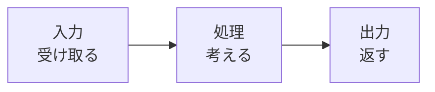

## このセクションで学ぶこと

- コンピュータの動きが「入力・処理・出力」の3ステップでできていると理解する
- 身近な例を「入力・処理・出力」に分けて説明できる
- どんなコンピュータも、この基本の流れに当てはまることに気づく

## コンピュータは3ステップで動く

前のセクションで、コンピュータは「計算する機械」だとお話ししました。では、その計算はどんな順番で進むのでしょうか。

実は、どんなコンピュータも、おおまかに次の3つのステップで動いています。

1. **入力** … 情報や合図を受け取る
2. **処理** … 受け取った情報を、決められた手順で計算・判断する
3. **出力** … その結果を、目に見える形や音、動作にして返す

この「入力 → 処理 → 出力」という流れは、コンピュータを理解するうえでいちばん大事な土台です。むずかしい言葉に見えますが、「受け取って、考えて、返す」と言いかえると、私たち人間がやっていることとそっくりです。

## 身近な例で考えてみる

この流れは、特別な機械だけのものではありません。身のまわりの道具に当てはめてみましょう。

**電卓の場合**

- 入力 … 「3」「+」「5」とボタンを押す
- 処理 … 中で 3 と 5 を足し算する
- 出力 … 画面に「8」と表示する

**電子レンジの場合**

- 入力 … 「あたため」ボタンと「1分」を押す
- 処理 … 1分間どれくらいの強さで動かすかを計算する
- 出力 … 1分間あたため、終わったら「ピー」と鳴らす

**スマホで写真を撮る場合**

- 入力 … シャッターボタンを押す
- 処理 … レンズが受け取った光を画像のデータに変える
- 出力 … 画面に写真を表示し、本体に保存する

どの例も、形はちがっても「入力 → 処理 → 出力」の流れになっていることがわかります。電卓では指でボタンを押すことが入力でしたが、写真を撮るときはレンズが受け取る光が入力でした。このように、入力の形はさまざまですが、「外から何かを受け取っている」という点は共通しています。処理と出力も同じで、見た目はちがっても役割は変わりません。

## どんな機械もこの流れに当てはまる

ここで大事なのは、新しい機械やアプリに出会ったときも、この3ステップに分けて考えると、急に分かりやすくなるということです。

「これは何を入力するの?」「中で何を処理しているの?」「結果はどう出力されるの?」と自分に問いかけてみてください。たとえば自動改札なら、入力はICカードをかざすこと、処理は運賃が足りているかの判断、出力は扉の開閉と残高の表示、というふうに整理できます。

注意したいのは、出力は必ずしも画面とは限らないことです。音が鳴る、ランプが光る、機械が動く、といったものもすべて立派な出力です。「結果を外に返している」ものはすべて出力だと考えてください。

## まとめ

- コンピュータは「入力 → 処理 → 出力」の3ステップで動いています
- 電卓も電子レンジもスマホも、この同じ流れに当てはまります
- 新しい機械に出会ったら、3ステップに分けて考えると理解しやすくなります
