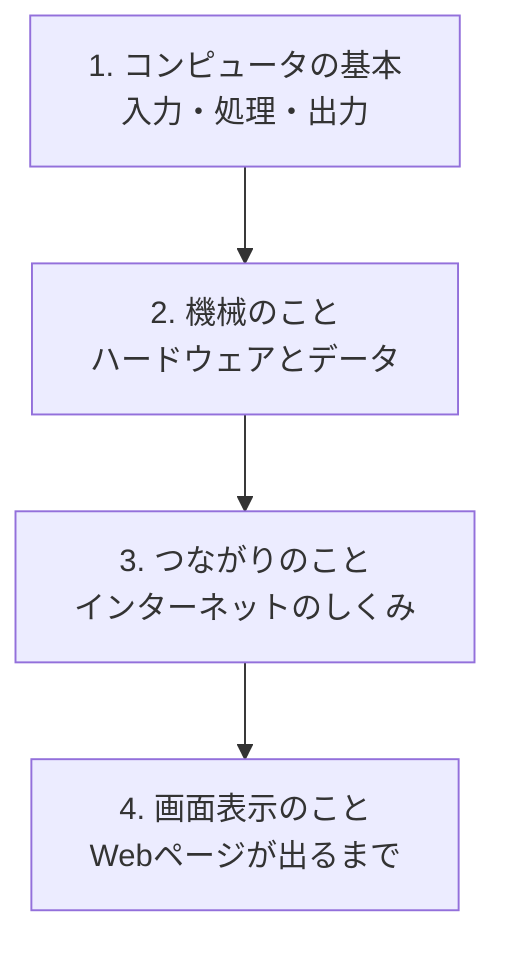

## このセクションで学ぶこと

- この教材が「機械・つながり・画面表示」の順番で進むことを把握する
- それぞれのテーマが、どんな疑問に答えるものかをイメージできる
- 全体像を先に持つことで、これからの学習で迷子にならない準備をする

## まずは地図を手に入れよう

初めての場所を旅するとき、いきなり歩き出すより、先に地図を見ておくと安心できます。学習も同じです。これから何をどんな順番で学ぶのかを先に知っておくと、一つひとつの話が「全体のどこにある話なのか」が分かり、ずっと頭に入りやすくなります。

この教材は、大きく分けて3つのかたまりで進んでいきます。「機械のこと」「つながりのこと」「画面に表示されるまで」の順です。下の地図を見てみましょう。

## それぞれのかたまりで学ぶこと

**1つめ:コンピュータの基本(今ここ)**

まずは、コンピュータが「入力・処理・出力」で動くという土台を学びました。すべての話のおおもとになる考え方です。

**2つめ:機械のこと(ハードウェアとデータ)**

次に、コンピュータの中身をのぞきます。「頭脳の役割をする部品」「作業をするための場所」「情報をしまっておく場所」など、機械を形づくる部品を見ていきます。あわせて、コンピュータが情報を0と1で扱っていることや、ファイルとフォルダで情報を整理するしくみも学びます。「パソコンの中ってどうなっているの?」という疑問に答える部分です。

**3つめ:つながりのこと(インターネット)**

続いて、世界中のコンピュータがどうつながっているのかを学びます。お願いする側とこたえる側の関係や、住所のような番号、名前を住所に変えるしくみなどを、たとえを使って理解します。「インターネットってどうやって相手とつながっているの?」に答える部分です。

**4つめ:画面表示のこと(Webページが出るまで)**

最後に、これまで学んだことを総合して、「ホームページのアドレスを入力してから、画面にページが表示されるまで」の一連の流れを追いかけます。バラバラに学んだ知識が、ここで1本につながります。ふだん何気なく見ているホームページの裏側で、たくさんの機械が連携して働いていることが見えてくるはずです。

このように、この教材は「身近なところから始めて、だんだん奥へ」という順番になっています。いきなり専門的な話には入らず、まず全体の土台を固めてから、機械、つながり、表示と、一歩ずつ視野を広げていく組み立てです。

## あせらず一歩ずつで大丈夫

注意したいのは、この地図のすべてを今すぐ覚える必要はない、ということです。「だいたいこういう順番で進むんだな」と分かっていれば十分です。地図はあくまで全体を見渡すためのもので、細かい地名まで暗記する必要がないのと同じです。

それぞれのテーマは、前のテーマの上に積み上がっていきます。たとえば「つながりのこと」は「機械のこと」を知っていると理解しやすく、「画面表示のこと」はそれまでの全部を使います。ですから、順番に進んでいくのがいちばんの近道です。途中で分からなくなったら、前のセクションに戻って確認すればよいのです。誰でも最初は分からないのがあたりまえですから、つまずいても気にせず、地図を片手に、あせらず一歩ずつ進んでいきましょう。

## まとめ

- この教材は「機械 → つながり → 画面表示」の順番で進みます
- 各テーマは「中身は?」「どうつながる?」「どう表示される?」という疑問に答えます
- 全体地図を持っておけば、迷っても前に戻って確認できます
