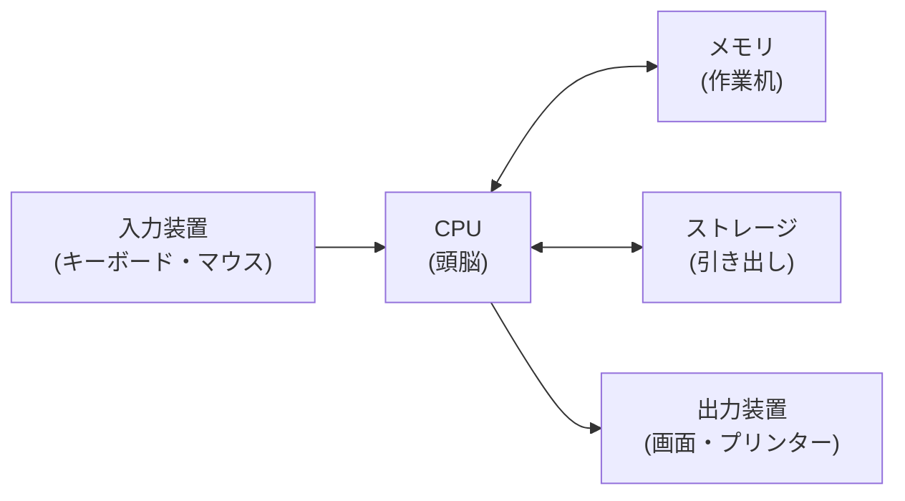

## このセクションで学ぶこと

- ハードウェアとは「手で触れる部品」のことだとわかる
- パソコンが複数の部品の協力で動いていることをイメージできる
- これから学ぶ部品(CPU・メモリ・ストレージ・入出力装置)の全体像をつかむ

## ハードウェアは「触れる部品」のこと

パソコンを開けてみると、中にはたくさんの板や金属の部品が詰まっています。こうした「手で触れる物理的な部品」をまとめて**ハードウェア**と呼びます。キーボードやマウス、画面も、外から見えるハードウェアの仲間です。

ハードウェアと対になる言葉が**ソフトウェア**です。ソフトウェアは、部品に「こう動きなさい」と指示を出すプログラムのことで、こちらは手で触ることができません。たとえるなら、ハードウェアは「楽器」、ソフトウェアは「楽譜」です。楽器があっても楽譜がなければ演奏できませんし、楽譜だけあっても音は出ません。両方そろってはじめて音楽になります。パソコンも同じで、部品とプログラムの両方がそろってはじめて役に立ちます。

身のまわりにあるものでも、この二つは区別できます。たとえばスマートフォンなら、手に持っている本体・画面・カメラのレンズはハードウェアです。一方、その中で動いている地図アプリやメッセージアプリ、写真を加工する機能などはソフトウェアです。同じ本体(ハードウェア)でも、入れるアプリ(ソフトウェア)を変えれば、できることがどんどん広がっていきます。これは、同じ楽器でも演奏する楽譜を変えればちがう曲が流れるのと同じことです。この章では、このうち「触れる部品」であるハードウェアのほうに注目していきます。

## 部品はチームで働いている

パソコンの中の部品は、それぞれ役割を持った「チームのメンバー」のようなものです。ひとつの部品がすべてをこなすのではなく、得意分野を分担して協力しています。

この章では、特に大切な次の部品を順番に見ていきます。

- **CPU**:計算や判断をする「頭脳」
- **メモリ**:作業中の情報を一時的に広げておく「作業机」
- **ストレージ**:情報を長く保管しておく「引き出し」
- **入力装置・出力装置**:人とパソコンの間で情報をやり取りする「窓口」

これらがどうつながっているかを、まず大きな絵で見てみましょう。

人が入力装置から情報を入れると、CPU がそれを受け取り、メモリやストレージとやり取りしながら処理し、結果を出力装置から私たちに返してくれます。第 1 章で学んだ「入力・処理・出力」の流れが、実際の部品の上で起きているわけです。この図を見ると、CPU がちょうど真ん中にいて、ほかの部品とやり取りの中心になっていることがわかります。CPU が「司令塔」、まわりの部品が「役割を分担した仲間たち」だとイメージしておくと、このあとの話がつながりやすくなります。

ここで一つだけ、たとえを整理しておきましょう。CPU は計算や判断をする「頭脳」、メモリは作業に使う「作業机」、ストレージは保管しておく「引き出し」です。この「頭脳・作業机・引き出し」という言いかえは、このあとのセクションでくり返し出てきます。いまは正確に覚える必要はありませんが、「役割ごとにあだ名がついている」くらいの気持ちで眺めておいてください。

## はじめは名前を覚えなくて大丈夫

たくさんの部品名が出てくると身構えてしまうかもしれませんが、いまは「パソコンはいくつかの部品が役割分担して動いている」とイメージできれば十分です。一つひとつの役割は、このあとのセクションで身近なたとえとともに、ゆっくり見ていきます。

## まとめ

- ハードウェアは手で触れる物理的な部品、ソフトウェアは目に見えない指示のこと
- パソコンの部品は役割を分担し、チームのように協力して動いている
- 入力 → CPU → メモリ/ストレージ → 出力という流れで情報がめぐっている
