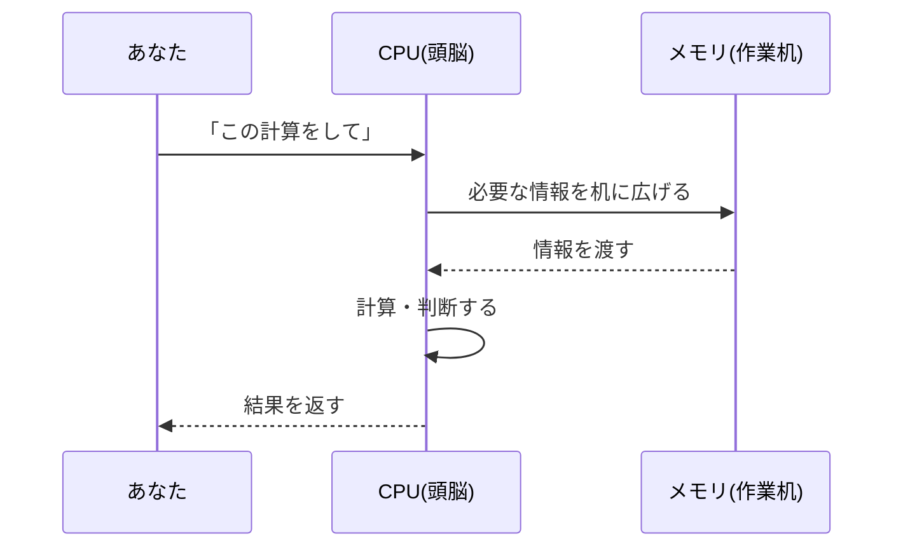

## このセクションで学ぶこと

- CPUがパソコンの「頭脳」として計算や判断を担うことを説明できる
- メモリが作業中の情報を一時的に置く「作業机」だとイメージできる
- CPUとメモリが協力して処理を進めるようすを理解する

## CPUはパソコンの頭脳

**CPU**は、パソコンの中で計算や判断を行う部品で、いわば「頭脳」にあたります。数字を足したり、二つの値を比べたり、「もしこうなら次はこうする」と判断したりと、あらゆる処理の中心を担います。

私たちが文字を入力する、ボタンを押す、動画を再生する——こうした操作の裏側では、CPU が膨大な数の小さな計算を、目にも留まらぬ速さでこなしています。CPU が速くて優秀なほど、パソコンはきびきびと動きます。「このパソコンは処理が速い」と感じるとき、その中心にいるのが CPU です。

CPU は一見むずかしそうに見えますが、やっていることはとてもシンプルです。「足す」「比べる」「次にどの命令に進むかを決める」といった、ごく単純な作業をくり返しているだけです。ただし、その一つひとつを 1 秒間に何億回ものすごい速さでこなすため、結果として写真の加工や動画の再生といった複雑なことができるのです。人間が一つずつ手で計算したら何年もかかる作業を、CPU は一瞬で終わらせます。「単純な作業を、信じられない速さで大量にこなす働き者」——それが CPU のイメージです。

## メモリは「作業机」

CPU が仕事をするには、いま使っている情報をすぐ手の届く場所に広げておく必要があります。その置き場所が**メモリ**です。メモリは「作業机」にたとえるとわかりやすい部品です。

机が広ければ、本やノートや資料をたくさん広げたまま作業でき、いちいち片付けたり取り出したりせずにすみます。メモリも同じで、容量が大きいほど多くの情報を同時に広げておけるので、たくさんのアプリを開いても動きが重くなりにくくなります。逆に机が狭いと、ものを置く場所が足りず、作業のたびにバタバタしてしまいます。

ただし、作業机の上は「いま作業しているあいだだけ」の置き場所です。パソコンの電源を切ると、メモリの上に広げていた情報は消えてしまいます。これはとても大切な性質なので、覚えておきましょう。大事な書類を消したくなければ、机の上に置きっぱなしにせず、引き出し(ストレージ)にしまう必要があります。引き出しについては次のセクションで学びます。

## CPUとメモリの協力

CPU とメモリは、たえず情報をやり取りしながら仕事を進めています。

CPU は「考える人」、メモリは「考えるための材料を広げておく机」です。優秀な頭脳でも、机が狭くて材料を広げられなければ実力を出しきれません。両方のバランスがそろってこそ、パソコンは快適に動きます。

身近な場面で考えてみましょう。たとえばインターネットを見ながら、文書を書いて、音楽を流す——この三つを同時にしているとき、それぞれのアプリの情報がメモリ(机)の上に広げられています。机が広ければ三つを並べたまま快適に進められますが、机が狭いと置ききれず、パソコンの動きがだんだん重くなります。「アプリをたくさん開くと動作が遅くなる」と感じたことがあれば、それはメモリの机が手狭になっているサインかもしれません。

一方で、メモリだけ大きくしても、考える本人である CPU が遅ければ作業全体は速くなりません。逆に、CPU がいくら優秀でも、机が狭くて材料を広げられなければ本領を発揮できません。料理にたとえるなら、CPU は腕のいい料理人、メモリは調理台の広さです。腕がよくても台が狭ければ手際よく作れませんし、台が広くても料理人がいなければ料理は完成しません。だからこそ、この二つはどちらも欠かせない相棒なのです。

## まとめ

- CPUは計算や判断を担う「頭脳」で、処理の速さを左右する
- メモリは作業中の情報を広げておく「作業机」で、広いほど同時にたくさん扱える
- メモリの中身は電源を切ると消える(一時的な置き場所である)
