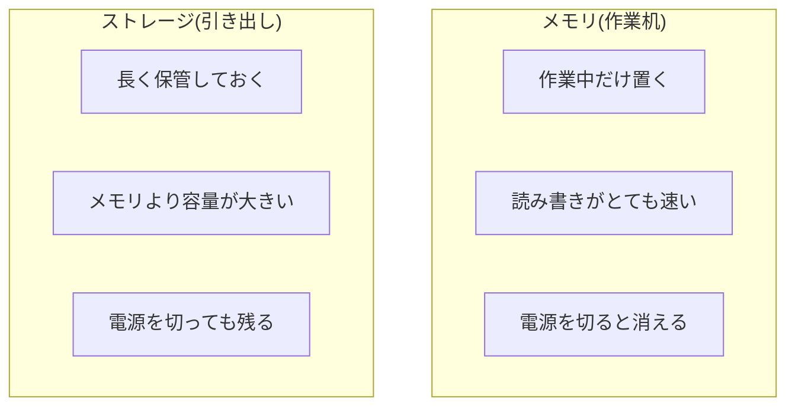

## このセクションで学ぶこと

- ストレージが情報を長く保管する「引き出し」だとイメージできる
- メモリ(作業机)とストレージ(引き出し)の違いを区別できる
- 電源を切っても消えるもの・残るものを説明できる

## ストレージは「引き出し」

撮った写真、書きかけの書類、ダウンロードした音楽——こうした情報を、電源を切ったあともずっと保管しておく部品が**ストレージ**です。前のセクションのたとえを続けるなら、ストレージは「引き出し」にあたります。

作業机(メモリ)の上は一時的な置き場所でしたが、引き出し(ストレージ)にしまったものは、片付けて電源を切っても消えません。翌日もう一度パソコンを開けば、昨日保存した書類はちゃんと引き出しの中に残っています。私たちが「保存する」と操作するのは、机の上のものを引き出しにしまう作業だとイメージするとわかりやすいでしょう。

ストレージには、円盤を回して記録する昔ながらの**HDD**と、動く部品がなく読み書きが速い**SSD**があります。HDD はレコード盤のように円盤を回しながら情報を読み書きするしくみで、動く部品があるぶん音がしたり、SSD よりは読み書きがゆっくりだったりします。一方の SSD は中に動く部品がなく、静かでこわれにくく、読み書きもずっと速いのが特徴です。最近のパソコンは SSD が主流で、電源を入れてからすぐ使えたり、ファイルを開く動作がきびきびしているのは、この速さのおかげです。どちらも「電源を切っても情報が残る」という点は共通していて、保管の役割は変わりません。

## メモリとストレージの違い

ここがこの章でいちばんつまずきやすいところです。二つを並べて整理しましょう。

ポイントは「速さ」と「残るかどうか」です。メモリは速いけれど一時的、ストレージはたっぷりしまえて消えない、という役割分担になっています。どちらが優れているという話ではなく、性質が違うので両方が必要なのです。

この違いを実感できる身近な出来事があります。文書を書いている途中で、保存しないままパソコンの電源が急に切れてしまうと、書いた内容が消えてしまうことがあります。これは、作業中の文章がまだ作業机(メモリ)の上にあっただけで、引き出し(ストレージ)にしまっていなかったために起こります。だからこそ、大事な作業はこまめに「保存」して、机の上から引き出しへ移しておくことが大切なのです。「保存ボタンを押す」という何気ない操作が、実はメモリからストレージへ情報を移す大事な行動だった、というわけです。

## 容量が大きい=速い、ではない

よくある勘違いに「ストレージの容量が大きければパソコンが速くなる」というものがあります。容量はあくまで「どれだけしまえるか」であって、処理の速さとは別です。たくさん写真を保存したいなら容量の大きいストレージ、たくさんのアプリを同時に快適に使いたいならメモリ、という具合に、目的によって見るべき部品が変わります。混同しないように気をつけましょう。

## まとめ

- ストレージは情報を長く保管する「引き出し」で、電源を切っても中身は残る
- メモリは速いが一時的、ストレージは大容量で消えないという役割分担になっている
- 容量の大きさは「しまえる量」であり、処理の速さとは別の話である
