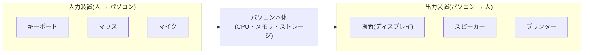

## このセクションで学ぶこと

- 入力装置が「人からパソコンへ情報を渡す窓口」だとわかる
- 出力装置が「パソコンから人へ情報を返す窓口」だとわかる
- 身近な入力装置・出力装置の例を挙げられる

## 人とパソコンをつなぐ窓口

CPU・メモリ・ストレージはパソコンの中で働く部品でしたが、私たち人間はそれらに直接話しかけることはできません。そこで、人とパソコンの間で情報をやり取りする「窓口」の役割をする部品があります。それが**入力装置**と**出力装置**です。

**入力装置**は、人からパソコンへ情報を渡すための部品です。キーボードで文字を打つ、マウスでクリックする、マイクで声を入れる——これらはすべて「人 → パソコン」の方向に情報を送っています。

**出力装置**は反対に、パソコンから人へ情報を返すための部品です。画面に文字や映像を映す、スピーカーから音を出す、プリンターで紙に印刷する——これらは「パソコン → 人」の方向です。

第 1 章で学んだ「入力・処理・出力」の流れを思い出してみましょう。入力装置はその「入力」を、出力装置は「出力」を担当する部品だと考えると、すっきり整理できます。私たちが入力装置から合図を送り、CPU やメモリ・ストレージが裏側で「処理」をし、その結果を出力装置が私たちに見せてくれる——この一連のやり取りの、人と接する両端にいるのが入力装置と出力装置なのです。

## 身近な例で覚える

それぞれの代表的な例を整理してみましょう。

判断に迷ったら「人からパソコンへ送っているのか、パソコンから人へ返ってくるのか」と向きを考えると区別できます。キーボードは情報を送るので入力、画面は情報が返ってくるので出力、という具合です。

ほかにも身近な装置はたくさんあります。たとえば、紙の書類を読み取ってデータにするスキャナーは入力装置、撮った映像を取り込むWebカメラやゲームのコントローラーやICカードリーダーも入力装置です。反対に、文字を紙に印刷するプリンター、映像を大きく映すプロジェクター、振動で知らせるスマホのバイブレーションは出力装置です。新しい機器を見たときも、「これは人がパソコンに何かを伝える道具かな、それともパソコンが人に何かを返す道具かな」と向きを考えれば、どちらの仲間なのか自分で見分けられます。

## 両方を兼ねる装置もある

中には、入力と出力の両方をこなす装置もあります。代表が**タッチパネル**です。指で触れて操作する点では入力装置ですが、同時に映像を映す点では出力装置でもあります。スマートフォンの画面はまさにこの両方を兼ねています。「入力か出力か、どちらかひとつに必ず分かれる」と思い込まず、こうした例外もあると知っておくと、実際の機器を見たときに戸惑いません。

## まとめ

- 入力装置は「人 → パソコン」、出力装置は「パソコン → 人」へ情報を運ぶ窓口
- キーボードやマウスは入力、画面やスピーカーやプリンターは出力の代表例
- タッチパネルのように入力と出力を兼ねる装置もある
