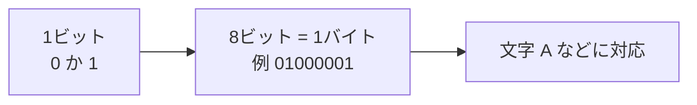

## このセクションで学ぶこと

- コンピュータは情報をすべて「0」と「1」の組み合わせで表していること
- 0と1のひとマスを「ビット」、それが8個集まったまとまりを「バイト」と呼ぶこと
- 文字も写真も音も、最後はすべて0と1に置きかえられていること

## コンピュータが分かるのは「ある」か「ない」かだけ

わたしたちは、文章を読んだり写真を見たり音楽を聞いたりするとき、それぞれを別のものとして受けとっています。ところがコンピュータの中では、これらはすべて同じやり方で表されています。それが「0」と「1」です。

なぜ0と1だけなのでしょうか。コンピュータは電気で動く機械です。電気の世界では「電気が流れている」か「流れていない」か、いわば「ある」か「ない」かの2つの状態をはっきり区別するのがいちばん確実です。この2つの状態に「1」と「0」という名前をつけて、すべての情報をこの2つだけで表すことにしたのです。スイッチのオンとオフ、と考えるとイメージしやすいかもしれません。

このように、情報を0と1のような区切られた数で表すやり方を「デジタル」と呼びます。みなさんがよく聞く「デジタル」という言葉の正体は、実はこの0と1の世界のことなのです。

## ビットとバイト — 0と1を数えるための言葉

0か1か、ひとマス分の情報のことを「ビット」と呼びます。これがコンピュータの世界でいちばん小さな情報のまとまりです。

ただ、ビット1つでは「ある・ない」しか表せず、できることがとても限られます。そこでビットを何個か並べて使います。たとえばビットを8個ならべると、0と1の組み合わせは256通りにもなります。これだけあれば、文字や数字を1つずつ割りあてるのに十分です。このビット8個分のまとまりを「バイト」と呼びます。

おおざっぱには「半角の文字1つ分がだいたい1バイト」と覚えておくと、後で容量の話をするときに役立ちます。

## 文字も写真も音も、最後は0と1

「文字が0と1なのは分かったけれど、写真や音はどうなるの」と思うかもしれません。実は、これらもすべて0と1に置きかえられています。

たとえば写真は、細かい点(色のついたマス目)の集まりです。1つ1つの点の色を数字で表し、その数字をさらに0と1に直すことで、写真全体が長い0と1の列になります。音も同じで、空気のふるえを細かく区切って数字にし、それを0と1に置きかえています。

つまりコンピュータの中では、見た目はまったく違う文章・写真・音楽が、どれも「0と1がたくさん並んだもの」として同じように扱われているのです。だからこそ、1台のパソコンで文章を書いたり写真を見たり音楽を聞いたりできるのですね。

## 気をつけたいこと

0と1という言葉だけを見ると難しそうに感じますが、わたしたちが普段これを意識することはほとんどありません。文字を打てば自動で0と1に変換され、画面に表示するときは自動で元に戻ります。「コンピュータは内側ではすべて0と1で扱っている」というイメージさえ持てれば十分です。

## まとめ

- コンピュータは「ある・ない」の2つの状態を使い、すべての情報を0と1で表します。
- 0か1のひとマスが「ビット」、8個集まると「バイト」で、文字1つ分くらいの目安です。
- 文字も写真も音も、最後はすべて0と1に置きかえられて同じように扱われます。
