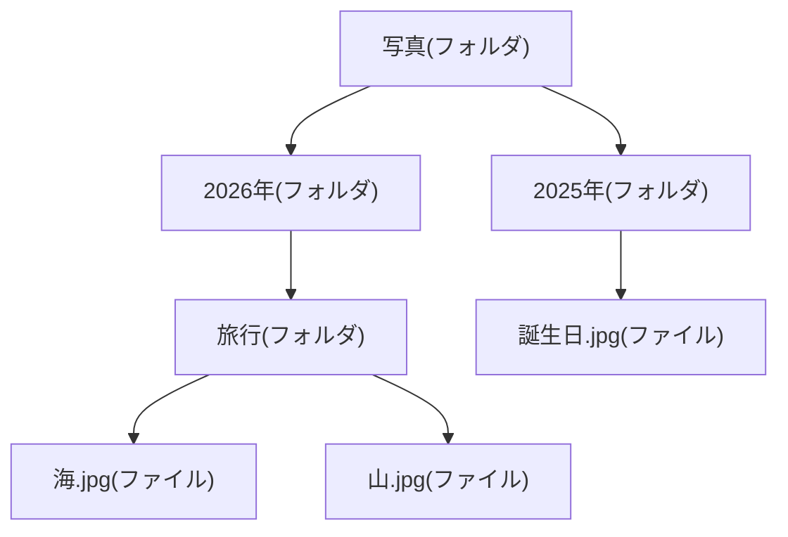

## このセクションで学ぶこと

- ファイルは「ひとまとまりのデータ」に名前をつけて保存したものであること
- フォルダはファイルをしまって整理するための入れ物であること
- フォルダの中にフォルダを入れる「入れ子」でツリー状に整理できること

## ファイルとは「名前をつけて保存したデータのかたまり」

前のセクションで、コンピュータの中の情報はすべて0と1だとお話ししました。でも、0と1がただ並んでいるだけでは、どこからどこまでが1枚の写真なのか、どれが昨日書いた文章なのか分かりません。

そこで、関係する0と1をひとまとまりにして、名前をつけて保存します。これが「ファイル」です。「旅行の写真」「会議のメモ」のように、わたしたちが扱いやすい単位ごとに、データに名前をつけて区切ったものだと考えてください。

ファイルの名前には、よく「.」のあとに短い文字がついています。たとえば写真なら「.jpg」、文章なら「.txt」のような形です。この末尾の文字を「拡張子」と呼び、そのファイルが写真なのか文章なのかといった種類を表す目印になっています。

## フォルダは「ファイルをしまう入れ物」

ファイルが増えてくると、机の上に書類が山積みになるのと同じで、目当てのものを探すのが大変になります。そこで使うのが「フォルダ」です。フォルダはファイルをしまっておく入れ物で、紙の書類を整理する「クリアファイル」や「引き出し」をイメージすると分かりやすいでしょう。

たとえば「仕事」というフォルダ、「プライベート」というフォルダをつくり、関係するファイルをそれぞれにしまっておけば、あとから探しやすくなります。フォルダは「ディレクトリ」と呼ばれることもありますが、同じものを指しています。

## フォルダの中にフォルダ — 入れ子で整理する

フォルダの便利なところは、フォルダの中にさらにフォルダを入れられることです。これを「入れ子」と言います。

たとえば「写真」というフォルダの中に「2026年」というフォルダをつくり、その中に「旅行」フォルダを置く、という具合です。こうして枝分かれしていく形は、木が枝を広げる様子に似ているので「ツリー(木)構造」と呼ばれます。

## 気をつけたいこと

整理しようとして、あまりに深くフォルダを重ねすぎると、かえって目当てのファイルにたどり着くのが大変になります。フォルダ分けは「あとで自分が探しやすいかどうか」を基準に、ほどほどの深さにしておくのがコツです。また、ファイル名はあとから見て中身が分かるように、短くても具体的につけておくと探しやすくなります。たとえば「資料1」「新しいファイル」のような名前ばかりだと、どれがどれだか分からなくなってしまいます。「2026年度予算」のように内容が伝わる名前にしておくと、フォルダを開かなくてもひと目で見分けがつきます。

なお、同じフォルダの中に、まったく同じ名前のファイルを2つ置くことはできません。これは、名前で1つ1つを区別しているためです。フォルダが違えば同じ名前のファイルがあっても問題ありません。整理の仕組みは「名前」と「入れ物」で成り立っている、と覚えておきましょう。

## まとめ

- ファイルは、データをひとまとまりにして名前をつけて保存したものです。
- フォルダはファイルをしまう入れ物で、整理に使います。
- フォルダの中にフォルダを入れる入れ子で、ツリー状に整理できます。
