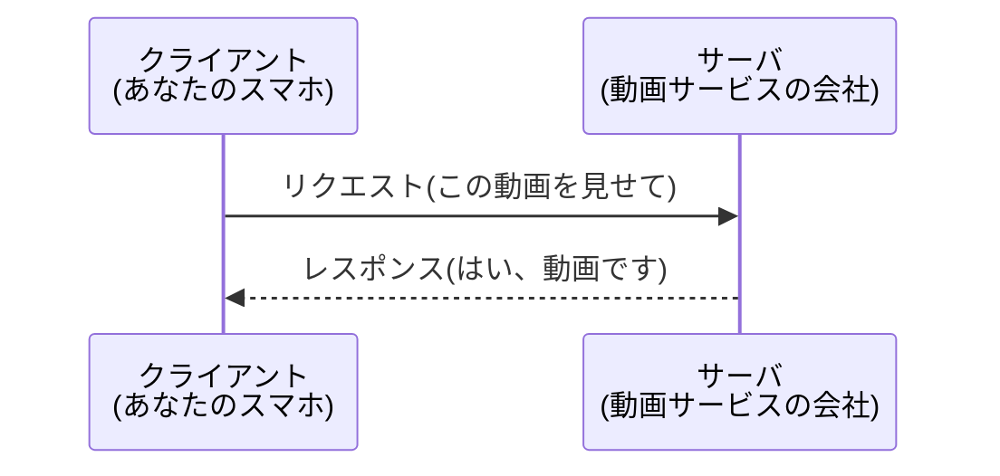

## このセクションで学ぶこと

- インターネットのやり取りは「お願いする側」と「応える側」に分かれていることを知る
- お願いする側を**クライアント**、応える側を**サーバ**と呼ぶことを覚える
- 身近なサービスがすべてこの関係で動いていることをイメージする

## インターネットは「たのむ人」と「こたえる人」でできている

スマホで天気を調べたり、動画を見たり、買い物をしたり。私たちは毎日インターネットを使っていますが、その裏側ではいつも同じかたちのやり取りがくり返されています。それは、**「たのむ人」と「こたえる人」**のやり取りです。

たのむ人のことを**クライアント**、こたえる人のことを**サーバ**と呼びます。むずかしそうな言葉ですが、中身はとてもシンプルです。あなたがスマホで「この動画を見せて」とお願いし、向こうのコンピュータが「はい、どうぞ」と動画を送り返してくれる。この「たのむ」と「こたえる」のセットが、インターネットの基本のかたちなのです。

このとき、クライアントから送る「お願い」を**リクエスト**、サーバから返ってくる「返事」を**レスポンス**と呼びます。

## 身近な例で考えてみる

レストランを思い浮かべてみてください。あなた(お客さん)が「カレーをください」と注文すると、店員さんが「かしこまりました」とカレーを運んできてくれます。このとき、注文する**お客さんがクライアント**、料理を出す**お店がサーバ**にあたります。注文が「リクエスト」、運ばれてくる料理が「レスポンス」です。

ふだん使っているサービスも、すべてこの関係で動いています。

- 検索サイトで調べものをするとき → あなたのブラウザがクライアント、検索サービスのコンピュータがサーバ
- 友だちにメッセージを送るとき → あなたのアプリがクライアント、メッセージを預かるコンピュータがサーバ
- ネットで買い物をするとき → あなたのスマホがクライアント、お店のコンピュータがサーバ

このように、私たちが使う側がクライアント、サービスを提供する側がサーバ、と覚えておけば大丈夫です。

## 注意したいこと

サーバは、特別なすごい機械というわけではありません。基本のしくみは私たちのパソコンと同じコンピュータです。ちがいは「**たくさんのお願いに、いつでも応えられるように、ずっと動き続けている**」という役割の部分にあります。お店が営業時間中ずっと開いているのと同じで、私たちがいつアクセスしても応えてくれるよう、サーバは休まず待ち構えているのです。

また、「クライアント」「サーバ」は機械そのものの名前というより、**役割の名前**だと考えてください。同じコンピュータでも、お願いする立場のときはクライアント、応える立場のときはサーバと呼ばれます。立場によって呼び名が変わる、と理解しておくと、このあとの話がすっきり頭に入ります。

## まとめ

- インターネットは「たのむ側=クライアント」と「こたえる側=サーバ」のやり取りでできている
- お願いを**リクエスト**、返事を**レスポンス**と呼ぶ
- クライアント・サーバは機械の種類ではなく、その時の**役割の名前**である
