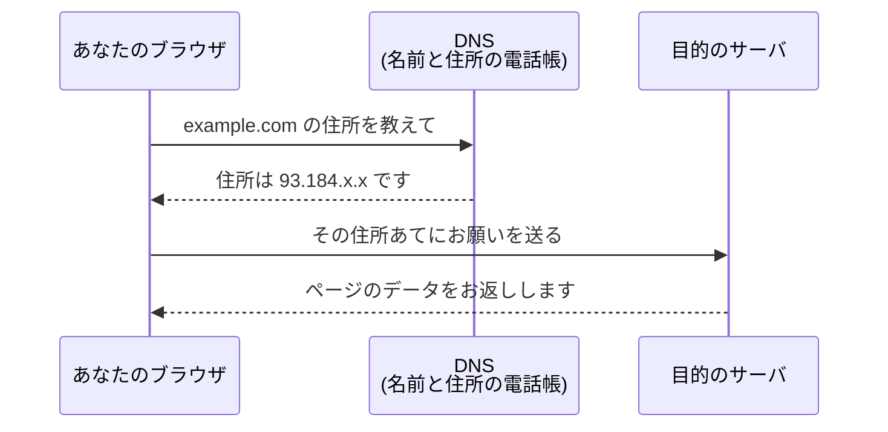

## このセクションで学ぶこと

- 私たちが入力する分かりやすい名前(**ドメイン名**)を知る
- 名前からIPアドレスを調べてくれるしくみが**DNS**であることを覚える
- DNSが「電話帳」のような役割をしていることをイメージする

## 名前と住所をつなぐしくみ

前のセクションで、機器には住所(IPアドレス)があると学びました。でも、ふだんネットを使うとき、私たちは数字の住所を打ち込んだりしません。代わりに `youtube.com` や `google.com` のような、読んで意味の分かる名前を入力します。この分かりやすい名前を**ドメイン名**と呼びます。

ここで問題になるのが、コンピュータは住所(IPアドレス)を使ってデータを届けるのに、私たちは名前(ドメイン名)しか知らない、というすれちがいです。この**名前と住所のあいだを取り持ってくれるしくみ**が、**DNS**です。

DNSは、いわば**電話帳**のようなものです。電話帳で人の名前を引くと電話番号が分かりますよね。それと同じで、DNSにドメイン名を尋ねると、それに対応するIPアドレスを教えてくれます。

## どうやって名前から住所が分かるのか

たとえば、あなたがブラウザに `example.com` と入力したとします。すると、画面に表示されるより前に、裏側でこんなやり取りが起きています。

まずブラウザがDNSに「`example.com` の住所(IPアドレス)を教えて」と尋ねます。DNSが住所を教えてくれたら、ブラウザはその住所あてにお願いを送ります。こうして、私たちが名前しか知らなくても、ちゃんと目的のサーバへたどり着けるのです。

## 身近な例で考えてみる

スマホの連絡先を思い出してください。友だちに電話をかけるとき、相手の名前をタップするだけでつながります。電話番号を一つひとつ覚えていなくても、連絡先(電話帳)が名前と番号を結びつけてくれているからです。DNSもこれと同じ役割をしています。私たちは覚えやすい名前だけ知っていればよく、面倒な番号の管理はDNSにまかせられる、というわけです。

もし連絡先がなかったら、電話をかけるたびに長い番号を思い出さなければならず、とても大変ですよね。それと同じで、もしDNSがなければ、サイトを見るたびに数字の住所を打ち込むことになります。DNSは、私たちが名前だけで快適にインターネットを使えるよう、裏で番号への変換を一手に引き受けてくれているのです。

## 注意したいこと

DNSがあるおかげで、私たちは数字の住所を覚えずにすんでいます。逆に言えば、DNSのしくみがうまく働かないと、名前から住所が引けず、サイトにつながらなくなることがあります。「サイトが開かない」というトラブルの原因が、実はこの名前→住所の変換でつまずいている、ということも珍しくありません。名前を住所に変える大切な裏方さん、と覚えておきましょう。

## まとめ

- 私たちが使う分かりやすい名前を**ドメイン名**という
- **DNS**は、ドメイン名から対応するIPアドレスを調べてくれる電話帳のようなしくみ
- 名前しか知らなくても目的のサーバへたどり着けるのは、DNSのおかげ
