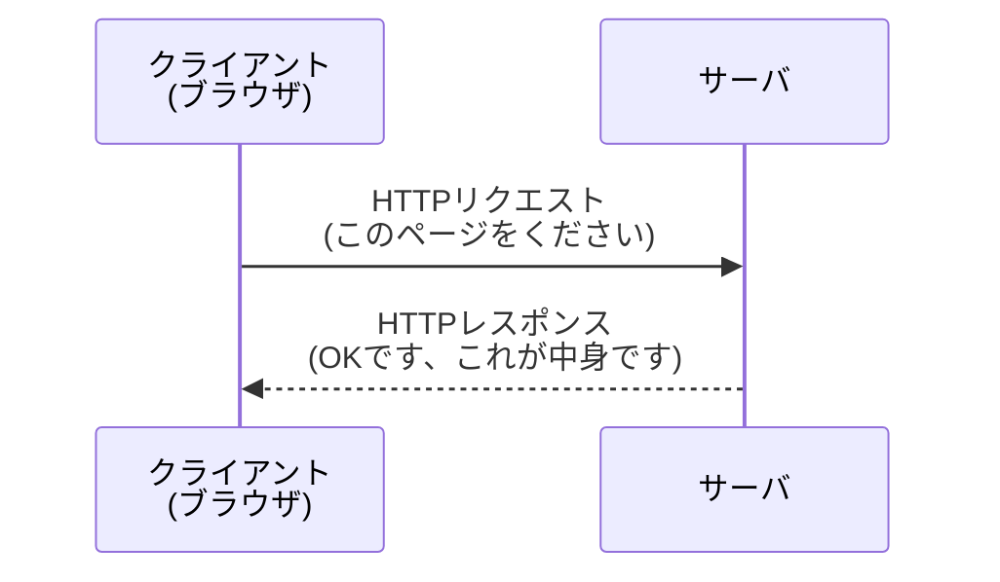

## このセクションで学ぶこと

- クライアントとサーバが同じ手順でやり取りするための約束ごとがあることを知る
- その約束ごとを**HTTP**と呼ぶことを覚える
- HTTPがリクエストとレスポンスの「決まったかたち」を定めていることをイメージする

## やり取りには「共通の約束ごと」が必要

このセクションまでで、クライアントがサーバにお願い(リクエスト)を送り、サーバが返事(レスポンス)を返すこと、そして名前(ドメイン名)から住所(IPアドレス)を調べてサーバへたどり着くことを学びました。では、いざサーバへつながったあと、ふたりは**どんな言葉で、どんな順番で**話せばいいのでしょうか。

ここで活躍するのが**HTTP**という約束ごとです。クライアントとサーバが、たがいに分かるかたちでやり取りするための「話し方のルール」だと考えてください。このような、機器どうしが守る共通の約束ごとのことを、まとめて**プロトコル**と呼びます。HTTPは、Webページをやり取りするためのプロトコルの一つです。

どんなに頭のいいコンピュータどうしでも、話し方がバラバラでは通じ合えません。送る側と受け取る側が同じルールに従っているからこそ、世界中のどんなパソコンとサーバでもきちんと会話ができるのです。

## HTTPが定めている「決まったかたち」

HTTPは、リクエストとレスポンスをどんなかたちで送るかを細かく決めています。たとえばリクエストには「どのページがほしいのか」を書き、レスポンスには「お願いはうまくいったか」「中身はどんなデータか」を書く、といった具合です。

お願いと返事が、HTTPという決まったかたちに沿って行き来していることが分かります。ブラウザのアドレス欄に出てくる `http://` や `https://` という文字は、まさに「このHTTPという約束ごとでやり取りしますよ」という目印なのです。

## 身近な例で考えてみる

宅配便を思い浮かべてください。荷物を送るときは、伝票に「あて先」「品名」「送り主」を決まった場所に書きますよね。どの配送会社でも様式が決まっているから、係の人はどこを見れば何が分かるかをすぐに判断できます。HTTPもこれと同じで、「ここにはお願いの中身を書く」「ここには結果を書く」と場所と書き方が決まっているおかげで、コンピュータどうしが迷わずやり取りできるのです。

## 注意したいこと

最近のサイトでは `http://` よりも、末尾に s の付いた `https://` をよく見かけます。これは**HTTPS**といって、HTTPに「やり取りの中身を他人に盗み見されないようにする工夫」を加えた、より安全な約束ごとです。基本のかたちはHTTPと同じで、そこに安全のための仕組みが足されている、と理解しておけば十分です。買い物やログインなど大切な情報を送る場面では、`https://` になっているかを確かめる習慣をつけると安心です。

## まとめ

- クライアントとサーバが同じ手順でやり取りするための約束ごとが**HTTP**
- 機器どうしが守る共通の約束ごとをまとめて**プロトコル**と呼ぶ
- HTTPはリクエストとレスポンスの「決まったかたち」を定めており、より安全にした**HTTPS**もある
