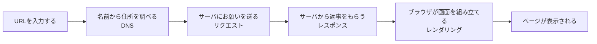

## このセクションで学ぶこと

- URLが「Webページの場所を示す住所」であることを理解する
- URLを入力してからページが出るまでに、いくつもの段取りがあることをつかむ
- この章全体で学ぶ流れ(名前を調べる → お願いする → 返事をもらう → 組み立てる)を見渡す

## URLは「ページの住所」

ふだんブラウザでWebページを見るとき、私たちは画面の上のほうにある細長い欄に文字を打ち込んだり、検索結果のリンクをクリックしたりしています。このときブラウザに渡している文字列が「URL(ユーアールエル)」です。たとえば `https://example.com` のようなものを、どこかで目にしたことがあるはずです。

URLは、ひとことで言えば「Webページの住所」です。前の章で、インターネット上のコンピュータには住所にあたるIPアドレスがあり、人にわかりやすい名前(ドメイン名)からそれを調べる仕組み(DNS)があると学びました。URLは、その名前に「どのページを見たいか」までふくめて、まとめて書いたものだと考えてください。郵便で言えば、あて先の住所だけでなく「○○様の△△の部屋」まで指定しているようなイメージです。

## 「入力したらすぐ出る」ように見えて、実は何段階もある

URLを入れてエンターキーを押すと、ほんの一瞬でページが表示されます。あまりに速いので「打ち込んだら、そこにページが出てくる」と感じるかもしれません。でも実際には、その裏で複数のコンピュータが短い時間に何度もやり取りをしています。

おおまかには、次のような順番で物事が進みます。

この図の一つひとつが、この章のこれからのセクションのテーマになっています。「住所を調べる」「お願いを送る」はこのあとのセクションで、「返事をもらう」「画面を組み立てる」はさらにそのあとで、ゆっくり見ていきます。今は「一瞬に見えるけれど、ちゃんと段取りを踏んでいるんだな」と感じてもらえれば十分です。

たとえるなら、お店に荷物の配達をたのむようすに似ています。まず相手のお店の場所(住所)を調べ、次に「これを届けてください」とお願いし、しばらくして荷物が届き、最後にその荷物を開けて中身を取り出す。Webページが表示されるまでの流れも、これと同じように一つずつ順を追って進んでいきます。一つひとつの段階には、それぞれちゃんと役割を持った相手がいるのです。

## いきなり全部おぼえなくて大丈夫

ここで注意したいのは、この図のすべてを今すぐ暗記しようとしないことです。大事なのは「順番がある」ということと、「それぞれの段階でだれが何をしているか」を、このあと一つずつたどっていくことです。流れの全体像を先に持っておくと、次のセクションで細かい話が出てきても「あ、これはあの図のここの部分だ」と迷子になりません。地図を先に見てから歩き出すようなものだと思ってください。

## まとめ

- URLは「どのWebページを見たいか」を示す住所のような文字列です
- 一瞬で表示されているように見えても、裏では何段階もの段取りが進んでいます
- これから「名前を調べる → お願いする → 返事をもらう → 組み立てる」の順に学んでいきます
