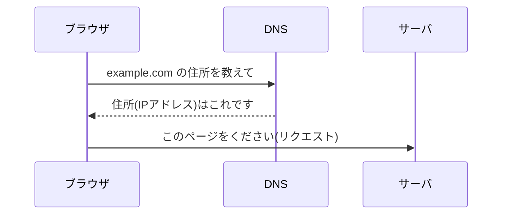

## このセクションで学ぶこと

- ブラウザがまず、名前から住所(IPアドレス)を調べることを理解する
- 住所がわかったあと、サーバに「このページをください」とお願いを送ることをつかむ
- このお願いを「リクエスト」と呼ぶことを知る

## まずは住所を調べる(DNS)

前のセクションで、URLは「ページの住所」だとお話ししました。ただし、URLに書かれている `example.com` のような名前は、人間にわかりやすいようにつけられた呼び名です。コンピュータどうしが実際にやり取りするときは、数字でできた住所である「IPアドレス」が必要になります。

そこで活躍するのがDNSです。前の章でも登場しましたが、DNSは「名前を住所に変えてくれる電話帳のような仕組み」でした。ブラウザはURLを受け取ると、まずDNSにこう問い合わせます。「`example.com` という名前のコンピュータの住所(IPアドレス)を教えてください」。DNSが住所を返してくれて、はじめてブラウザは「どこに連絡すればいいか」がわかります。

電話をかける場面を想像してみてください。相手の名前は知っていても、電話番号がわからなければかけられません。名前から番号を調べる電話帳が、ここでのDNSにあたります。

## 住所がわかったら、お願いを送る(リクエスト)

住所(IPアドレス)がわかったら、いよいよブラウザはそのサーバに連絡します。このとき送るのが「リクエスト」です。リクエストとは、ひとことで言えば「このページのデータをください」というお願いのメッセージです。

ブラウザはサーバに対して、ただ「ください」と言うだけではありません。「どのページがほしいのか」「どんな形でほしいのか」といった情報もそえて送ります。お店で注文するとき、「メニューのこれを、テイクアウトでお願いします」と具体的に伝えるのと似ています。あいまいに頼むより、はっきり伝えたほうが、ほしいものが正しく返ってくるのです。

この図のように、ブラウザはまずDNSに名前をたずね、住所を受け取ってから、その住所のサーバへリクエストを送ります。順番が大事で、住所がわからないうちはサーバにお願いを送ることができません。

## 「お願いする側」と「応える側」を思い出す

ここで注意しておきたいのは、だれがだれにお願いしているのか、という役割です。前の章で学んだとおり、お願いする側を「クライアント」、応える側を「サーバ」と呼びます。ブラウザはまさにクライアントの代表で、私たちのかわりにサーバへお願いを出してくれています。

リクエストはあくまで「お願い」であって、この時点ではまだページのデータは手元にありません。お願いを送り終えたら、ブラウザはサーバからの返事を待ちます。その返事がどんなものかは、次のセクションで見ていきましょう。

## まとめ

- ブラウザはまずDNSで、名前から住所(IPアドレス)を調べます
- 住所がわかったら、サーバに「このページをください」というお願い=リクエストを送ります
- リクエストは「お願い」であり、ページのデータをもらうのはこのあとです
