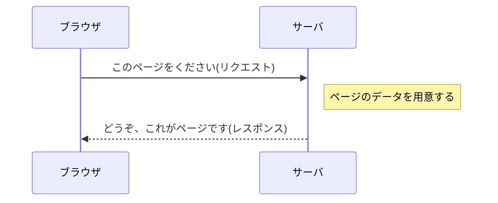

## このセクションで学ぶこと

- サーバがリクエストに応えて返すデータを「レスポンス」と呼ぶことを理解する
- レスポンスにはページの中身(文字や画像など)が含まれることをつかむ
- リクエストとレスポンスが、一往復のやり取りになっていることを理解する

## サーバからの返事=レスポンス

前のセクションで、ブラウザはサーバに「このページをください」というお願い(リクエスト)を送りました。そのお願いを受け取ったサーバは、求められたページのデータを用意して、ブラウザに送り返します。この返事のことを「レスポンス」と呼びます。

リクエストとレスポンスは、いつもペアになっています。お願いがあれば、それに対する返事がある。お店で「コーヒーをください」と注文(リクエスト)すると、店員さんがコーヒーを出してくれる(レスポンス)。あの一往復のやり取りと、まったく同じ関係です。

## レスポンスの中身には何が入っている?

では、レスポンスとして返ってくるのは何でしょうか。中身は、ページを表示するために必要なデータです。代表的なのは「HTML(エイチティーエムエル)」と呼ばれるものです。HTMLは、ページの文字や見出し、リンクなどの「中身と構造」を書き表した言葉だと考えてください。「ここは見出し」「ここは本文」「ここに写真を置く」といった指示が書かれた、いわば設計図のようなものです。

レスポンスにはこのHTMLのほかに、ページを見やすく飾るための情報や、写真・イラストなどの画像が含まれることもあります。ただし、大きなページでは、これらがすべて一度に届くとはかぎりません。最初にHTML(設計図)が届き、「この写真も必要だ」とわかってから、画像をあらためてお願いして受け取る、ということもよくあります。つまり、リクエストとレスポンスの一往復が、一回で終わらず何度かくり返される場合もあるのです。

## 「返事が返ってきた」だけではまだ見えない

ここで注意したいのは、レスポンスが届いた時点では、まだ私たちの目に「ページ」として見えているわけではない、ということです。届いたのはあくまでデータ、つまり文字で書かれた設計図や画像のかたまりです。これをそのまま画面に出しても、人が読めるきれいなページにはなりません。

設計図が手元に届いても、家がそのまま建っているわけではないのと同じです。届いたデータをもとに、実際に目に見えるページへ組み立てる作業が、このあと必要になります。その役目をになうのがブラウザで、次のセクションのテーマです。

なお、サーバからの返事には、ページのデータそのものだけでなく、「お願いがうまくいったかどうか」を知らせる合図もふくまれています。たとえば、お願いしたページが見つからないとき、サーバは「そのページはありません」という返事を返すことがあります。Webを見ていて「ページが見つかりません」という画面に出会ったことはないでしょうか。あれも、サーバがきちんとレスポンスを返してくれている一つの例です。返事には「はい、どうぞ」だけでなく「残念ですが見つかりませんでした」もある、と覚えておくとよいでしょう。

## まとめ

- サーバがリクエストに応えて返すデータを「レスポンス」と呼びます
- レスポンスにはHTMLなど、ページの中身を表すデータが入っています
- レスポンスはまだ「データ」であり、画面に見えるページに組み立てるのはこのあとです
