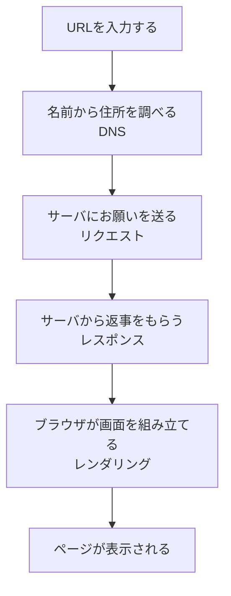

## このセクションで学ぶこと

- 届いたデータを目に見えるページに組み立てる作業を「レンダリング」と呼ぶことを理解する
- ブラウザがHTMLを読み取って、文字や画像を配置していく流れをイメージする
- URL入力からページ表示までの一連の流れを、最初から最後まで通して説明できる

## 届いたデータをページに組み立てる=レンダリング

前のセクションで、サーバからの返事(レスポンス)として、HTMLなどのデータが届きました。けれども、その時点ではまだ私たちが見ている「ページ」にはなっていません。届いたのは、文字で書かれた設計図のようなデータのかたまりです。

このデータを読み取って、見出しを大きく表示したり、本文を並べたり、写真を正しい場所に置いたりして、人が見て読める1枚のページに組み立てる。この作業のことを「レンダリング」と呼びます。むずかしそうな言葉ですが、要するに「設計図をもとに、実際のページを描き上げる」ことだと考えてください。この役目をになうのが、ふだん私たちが使っている**ブラウザ**です。

## ブラウザは設計図を読んで描いていく

ブラウザがレンダリングするようすを、家づくりにたとえてみましょう。届いたHTMLは「設計図」です。ブラウザは大工さんのように、その設計図を上から順に読んでいきます。「ここは大きな見出し」「ここは本文の段落」「ここには写真を1枚」といった指示を、一つずつ画面の上に形にしていくのです。

```mermaid
flowchart LR
  A[HTMLのデータ<br/>(設計図)] --> B[ブラウザが読み取る]
  B --> C[文字・見出しを配置]
  B --> D[画像を配置]
  B --> E[色やかざりをつける]
  C --> F[目に見えるページ]
  D --> F
  E --> F
```

このとき、もし「ここに写真を置く」と書かれていれば、ブラウザはその写真のデータをあらためてサーバにお願いして受け取り、できあがったページの中にはめ込みます。だから、ページによっては文字が先に出て、写真が少し遅れて表示されることがあるのです。あれは、ブラウザが設計図を読みながら、足りない材料を取り寄せて組み立てている途中の姿なのです。

## 一瞬の裏で起きていること、全体を振り返る

ここまでで、URLを入力してからページが表示されるまでの流れが、ひととおりそろいました。最後に、この章で学んだ全体を順番に振り返ってみましょう。



ふだんは一瞬で表示されるので、こんなにたくさんの段取りがあるとは気づきません。でも、ページがなかなか出てこないときや、写真だけ後から出てくるとき、その裏では「名前を調べて、お願いを送って、返事をもらって、組み立てる」という一連の流れが、けんめいに動いているのです。

## ここで注意したいこと

最後にひとつだけ注意点です。レンダリングはブラウザという「あなたの手元のソフト」がする仕事であって、サーバの仕事ではありません。サーバはあくまでデータ(設計図)を送るところまでが役割で、それを見えるページに仕上げるのはブラウザです。だから、同じデータでも、使っているブラウザや画面の大きさによって、見え方が少しちがうことがあります。「データを送る人」と「画面に描く人」が別々だと知っておくと、これからWebにふれるときの理解がぐっと深まります。

## まとめ

- 届いたデータを目に見えるページに組み立てる作業を「レンダリング」と呼びます
- ブラウザがHTMLという設計図を読み取り、文字や画像を配置してページを描きます
- URL入力からは「名前を調べる → お願いする → 返事をもらう → 組み立てる」の順で表示されます
