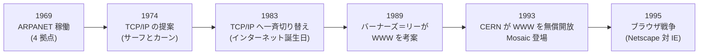

## このセクションで学ぶこと

- 「インターネット」と「Web」が実は別物である、という意外と知られていない事実
- スイスの研究所で生まれた WWW と、それを無償で世界に開放した発明者の決断
- 1990 年代の「ブラウザ戦争」が Web をみんなのものにした流れ

## インターネットと Web は別物

突然ですが、クイズです。「インターネット」と「Web」の違いを説明できますか? 多くの人が同じものだと思っていますが、実は別物で、生まれた年も 20 年ずれています(源流の ARPANET が 1969 年、WWW の考案は 1989 年)。

前のセクションまでに見たインターネットは、いわば**道路網**です。1983 年の時点で世界のコンピュータはつながっていましたが、その上を走っていたのはメールやファイル転送など、研究者向けの地味なサービスでした。普通の人が見て楽しいものは、まだ何もなかったのです。

その道路の上に「誰でも乗れる乗り物」を走らせたのが **WWW(World Wide Web)**です。つまり、インターネットが土台のネットワークで、Web はその上で動くサービスのひとつ。Web はメールや動画配信と同列の「インターネット上の住人」なのです。

## スイスの研究所で生まれた「世界規模のクモの巣」

1989 年、スイスにある欧州原子核研究機構(CERN)で働いていたイギリス人、**ティム・バーナーズ＝リー**は、ある悩みを抱えていました。世界中から集まる研究者たちの文書や情報が、コンピュータごと、部署ごとにバラバラに散らばっていて、探すのに苦労する——どこの職場にもありそうな悩みです。

彼の解決策は、文書の中の語句から別の文書へ直接ジャンプできる**ハイパーリンク**で、世界中の文書をクモの巣のようにつなぐことでした。提案書を読んだ上司が書き込んだ評価は「Vague, but exciting(曖昧だが、面白い)」。この控えめな一言から、World Wide Web が始まりました。

そして 1993 年、CERN は歴史的な決断をします。WWW の技術を**特許も使用料もなしで、誰でも自由に使える**と宣言したのです。バーナーズ＝リーは Web で巨万の富を築くこともできたはずですが、「みんなのもの」にする道を選びました。Web がここまで爆発的に広がった最大の理由のひとつが、この無償開放だと言われています。

## ブラウザ戦争 — 普及の起爆剤

とはいえ、初期の Web を見るには専門知識が必要でした。流れを変えたのが 1993 年のブラウザ **Mosaic** です。画像を文章と一緒に表示でき、マウスでクリックするだけ。開発した学生マーク・アンドリーセンらはその後 **Netscape Navigator** を生み出し、1990 年代半ばのブラウザ市場を制覇します。

これに焦ったのが Microsoft でした。**Internet Explorer** を Windows に標準搭載するという力技で猛追し、両者は新機能の追加合戦を繰り広げます。これが世に言う**ブラウザ戦争**です。競争は混乱も生みましたが(両ブラウザでしか動かないページが乱立しました)、結果として Web は急速に進化し、1990 年代末には一般家庭にまで普及しました。

ここまでの流れを年表で整理しましょう。

## 注意点 — 「Web の発明者」は億万長者ではない

バーナーズ＝リーは Web の標準化団体 W3C を設立し、「開かれた Web」を守る礎を築いた人物で、2012 年ロンドン五輪の開会式では「This is for everyone(これはみんなのもの)」というメッセージとともに紹介されました。「発明で儲けた人」ではなく「発明を手放した人」が Web を作った——この事実は、次章以降で見るオープンソース文化にもつながる、インターネットの大切な気質です。

## まとめ

- インターネットは「道路網」、Web はその上を走る「サービスのひとつ」で、別物である
- 1989 年にバーナーズ＝リーが WWW を考案し、1993 年に CERN が無償開放したことで爆発的に普及した
- Mosaic から始まるブラウザ戦争が、Web を研究者の道具から「みんなのもの」へ押し上げた
