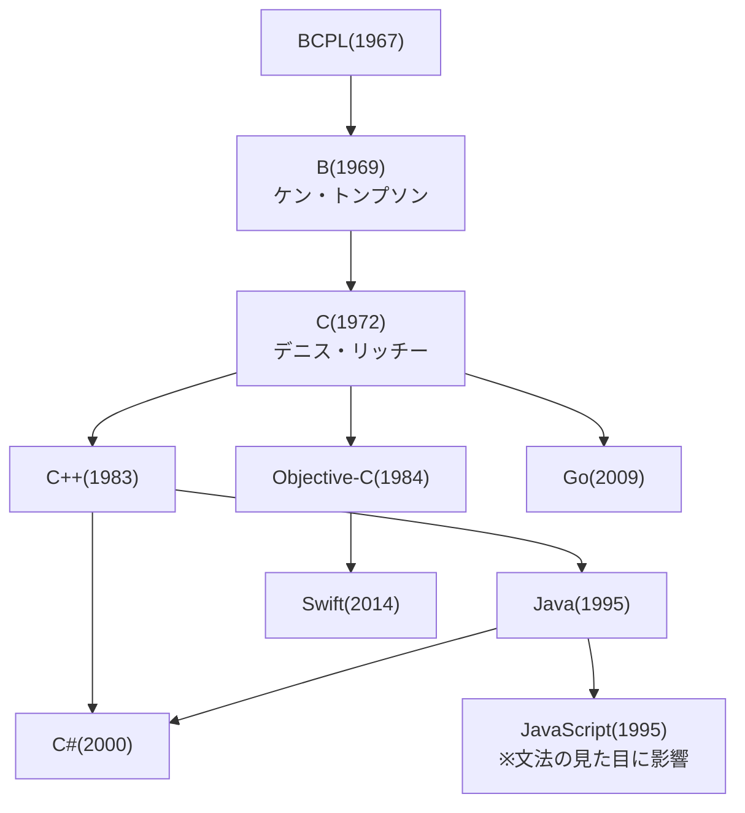

## このセクションで学ぶこと

- C という素っ気ない名前が「B の次だから」という単純な理由で付けられたこと
- C が OS「Unix」とともに生まれ、後続の言語たちの共通祖先になったこと
- C++ や C# の名前が、C からの「増分」を表す言葉遊びであること

## 「B の次だから C」

1972 年、米ベル研究所。デニス・リッチーは、開発中の OS「Unix」を書くための新しい言語を作っていました。下敷きにしたのは、同僚ケン・トンプソンが作った言語「B」。その改良版だから、アルファベットの次の文字で「C」。命名の理由は本当にそれだけです。

リッチーが同僚のブライアン・カーニハンと書いた解説書『プログラミング言語C』(著者 2 人の頭文字から通称 K&R)は、いまもプログラマの古典として読み継がれています。

ちなみに B 自体は、英国生まれの言語 BCPL(1967 年)を簡素化したものでした。そのため「C の次の言語は、アルファベット順で D なのか、それとも BCPL の綴りに従って P なのか」という冗談が、プログラマの間で長く語られています(後年、実際に D という名の言語も登場しました)。コメディ番組やコーヒーのような物語性は皆無の命名ですが、言語そのものは半世紀を生き延び、いまも OS や家電、ゲーム機の中核は C とその子孫たちで書かれています。

## 言語の家系図

C の本当のすごさは、その「子孫」の多さにあります。主な系譜を図にすると次のとおりです(矢印は文法や設計思想の影響を表します)。

前のセクションで見た Java も JavaScript も、この家系図の中にいます。処理のまとまりを波括弧 { } で囲む書き方や、if・for といった文法の骨格は、いずれも C から受け継いだものです。プログラミング言語の世界で C は、ヨーロッパの諸言語にとってのラテン語のような「共通の祖先」の位置にいるのです。

## 増やして名付ける — C++ と C#

子孫たちの名前には、C への敬意と言葉遊びが詰まっています。

C++ は 1983 年、ビャーネ・ストロヴストルップが自作の拡張言語に付けた名前です。「++」は C 言語で「値を 1 増やす」という意味の演算子。つまり C++ は「C を 1 つ進めた言語」という洒落です(当初の名前は素直に「C with Classes = クラス付き C」でした)。

C# は 2000 年に Microsoft が発表した言語です。# は音楽の嬰記号(シャープ)で、「C の半音上」を意味します。さらに # という記号は + を 4 つ並べた形にも見えるため、「C++++ = C++ をさらに進めた言語」という二重の言葉遊びになっています。

家系図には Objective-C(1984 年)という子孫もいます。長く Apple の iPhone アプリ開発を支え、2014 年にはその後継として Swift が登場しました。世代交代を重ねても、文法の根っこには C の面影が残り続けています。

## 注意点 — 家系図は「血縁」ではない

この家系図が表すのは文法や思想の影響であって、互換性ではありません。名前が似ていても、C# のプログラムが C で動くわけではなく、それぞれ独立した言語です。「見た目が似ているのはご先祖が同じだから」くらいの理解が、ちょうどよい距離感です。

## まとめ

- C の名前は「B の改良版だから次の文字」というだけの理由で付けられた
- C は Unix とともに生まれ、C++・C#・Java・Go など多くの言語の文法的祖先になった
- C++ は「C に 1 を足す」、C# は「C の半音上」— どちらも C からの増分を表す言葉遊び
