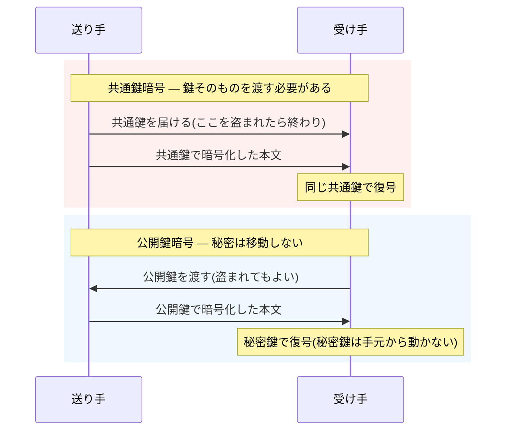

## このセクションで学ぶこと

- シーザー暗号からエニグマまで共通する「鍵配送問題」という宿命
- 「閉める鍵と開ける鍵を分ける」公開鍵暗号の逆転の発想
- ディフィーとヘルマン、RSA の発明と、英国諜報機関の知られざる先行発見

## 4000 年間つきまとった宿命 — 鍵配送問題

シーザー暗号とエニグマは、仕組みこそまったく違いますが、共通点が 1 つあります。暗号化と復号に「同じ鍵」を使うことです。この方式を「共通鍵暗号」と呼びます。送り手がずらし幅 3 で暗号化したなら、受け手もその 3 を知らなければ読めません。

ここに根本的な矛盾があります。鍵を相手に渡すには、盗み見されない安全な経路が必要です。しかし、そんな安全な経路があるなら、最初からそこで本文を送ればいいはずです。安全に話すための鍵を、安全に送れない。これが「鍵配送問題」で、4000 年間ずっと暗号につきまとった宿命でした。エニグマでさえ、月ごとの鍵設定表を全部隊に紙で配送しており、その奪取が解読の助けになったほどです。

軍隊や銀行なら、信頼できる配達人に鍵を運ばせることもできます。しかし、インターネットで初対面の通販サイトに接続するとき、事前に鍵を手渡ししておくことはできません。

## 逆転の発想 — 開いた南京錠を配る

1976 年、アメリカの研究者ホイットフィールド・ディフィーとマーティン・ヘルマンが、この宿命を覆す論文を発表します。発想はこうです。「閉める鍵と開ける鍵を、別のものにすればいい」。

南京錠を思い浮かべてください。私が「開いた状態の南京錠」を世界中にばらまきます。錠をカチッと閉めるのは誰にでもできますが、開けられるのは鍵を持つ私だけです。あなたが私に秘密を送りたければ、箱に入れて私の南京錠で閉めて送るだけでいい。途中で誰かに奪われても、開けることはできません。

この「誰でも使える閉める側の鍵」を公開鍵、「本人だけが持つ開ける側の鍵」を秘密鍵と呼びます。公開鍵は隠す必要がないどころか、世界中に公開してかまわない。「鍵を公開する暗号」という、それまでの常識からすれば正気とは思えない逆転の発想でした。

翌 1977 年には、MIT のリベスト、シャミア、エイドルマンの 3 人が、この構想を実現する具体的な方式を発表します。3 人の頭文字を取って「RSA 暗号」。大きな数の素因数分解が極端に難しいことを安全性の根拠にした方式で、現在もインターネットを支えています。数学の中身に立ち入らなくても、押さえるべき点は 1 つです。「掛け算は一瞬でできるのに、逆算には途方もない時間がかかる」という計算の一方通行性が、「閉めるのは誰でも簡単、開けるのは本人だけ」を実現しているのです。

## 実は英国が先に発見していた

ここに歴史の皮肉があります。イギリスの諜報機関 GCHQ では、ジェームズ・エリスが 1969 年に同じ着想に到達し、1973 年にはクリフォード・コックスが RSA とほぼ同じ方式を考案していました。しかしすべて国家機密とされ、公表されたのは 1997 年。世界が公開鍵暗号を「再発明」し、実用化を終えた後のことでした。秘密を守るための組織が、世紀の大発明まで秘密にしてしまったわけです。

なお、公開鍵暗号にも弱点があります。共通鍵暗号に比べて計算がずっと重く、すべての通信に使うには遅すぎるのです。そこで実際のインターネットでは両者を組み合わせて使います。その合わせ技こそ、次のセクションで見る HTTPS です。

## まとめ

- 共通鍵暗号には「鍵そのものを安全に送れない」という鍵配送問題が 4000 年間つきまとっていました
- 公開鍵暗号は「閉める鍵(公開鍵)と開ける鍵(秘密鍵)を分ける」ことで、鍵を渡さずに秘密の通信を可能にしました
- 1976 年のディフィーとヘルマン、1977 年の RSA が世界を変えましたが、英 GCHQ では数年早く同じ発見が機密のまま眠っていました
