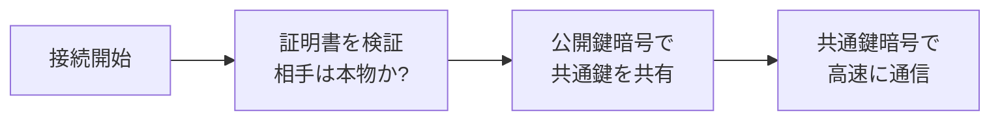

## このセクションで学ぶこと

- ブラウザの鍵マーク(HTTPS)が何を意味しているか
- HTTPS が共通鍵暗号と公開鍵暗号の「合わせ技」であること
- 鍵マークの意味と限界 — 暗号化されていても「安全なサイト」とは限らない

## 鍵マークの正体

Web サイトを開くと、ブラウザのアドレスバーに小さな鍵マークが表示され、URL は「https://」で始まっています。この末尾の s は secure(安全)の s で、通信が「TLS」という仕組みで暗号化されていることを示しています。

きっかけは 1990 年代前半、Web で買い物が始まろうとしていた時代です。暗号化のない通信では、クレジットカード番号がそのままネットワークを流れてしまいます。そこでブラウザ会社の Netscape が 1994 年から「SSL」という暗号化の仕組みを開発し、1999 年には標準化団体 IETF が引き継いで「TLS」と改名しました。正式名称は TLS になった今も、慣習的に SSL と呼ばれることがよくあります。

## 4000 年の合わせ技

前のセクションで触れたとおり、公開鍵暗号は鍵配送問題を解決しましたが、計算が重くて遅い。一方、共通鍵暗号は高速ですが、鍵を安全に渡せない。TLS はこの 2 つを組み合わせた、いいとこ取りの設計になっています。

接続のはじめに、公開鍵暗号を使って「今回の通信だけで使う共通鍵」を安全に共有します。鍵配送問題はここで公開鍵暗号が解決します。そして以降のやり取りは、高速な共通鍵暗号(AES など)で暗号化するのです。

シーザー以来 4000 年の歴史を持つ共通鍵暗号と、1970 年代に生まれた公開鍵暗号の合作。それが Web ページを開くたびに、一瞬のうちに実行されています。

## 相手は本物か — 証明書と認証局

ただし、暗号化だけでは足りません。通信相手が本物の銀行なのか、銀行になりすました偽サイトなのか、どう確かめればいいのでしょうか。受け取った公開鍵が偽者のものだったら、暗号化した内容はそのまま偽者に読まれてしまいます。

そこで TLS には「サーバー証明書」という仕組みがあります。「この公開鍵は確かにこのサイトのものです」と第三者機関が保証する電子的な証明書で、発行する機関を認証局(CA)と呼びます。ブラウザは信頼できる認証局のリストをあらかじめ持っていて、接続のたびに証明書を検証します。鍵マークは「暗号化」と「証明書の検証」の両方が成立した印なのです。

## 鍵マークが当たり前になるまで

かつて証明書は有料で、HTTPS はログイン画面や決済ページだけの特別な装備でした。流れを変えたのが、2014 年に発表された Let's Encrypt です。証明書を無料・自動で発行する仕組みを提供し、誰でも HTTPS を使えるようにしました。Google も HTTPS を検索順位の評価に取り入れ、Chrome は 2018 年から暗号化されていないページに「保護されていない通信」と警告を出すようになります。いまでは Web の通信の大半が HTTPS です。

注意点を 1 つ。鍵マークが保証するのは「通信が暗号化されていて、証明書がそのドメインのものである」ことだけです。詐欺サイトも証明書を取得できるため、鍵マークがあっても偽サイト(フィッシング)の可能性はあります。「鍵マーク=信頼できるサイト」ではないことは覚えておいてください。

それでも、スマートフォンで Web を開くその一瞬に、カエサルの換字、エニグマを破った数学者たちの執念、そして「鍵を公開する」逆転の発想が、すべて同時に動いています。あなたのポケットには、4000 年分の知恵比べの到達点が収まっているのです。

## まとめ

- ブラウザの鍵マークは、通信が TLS(旧称 SSL)で暗号化され、証明書の検証に成功したことを示します
- HTTPS は、公開鍵暗号で共通鍵を共有し、その後は高速な共通鍵暗号で通信する「合わせ技」です
- 鍵マークは通信の暗号化を保証するだけで、サイトの中身が信頼できることまでは保証しません
