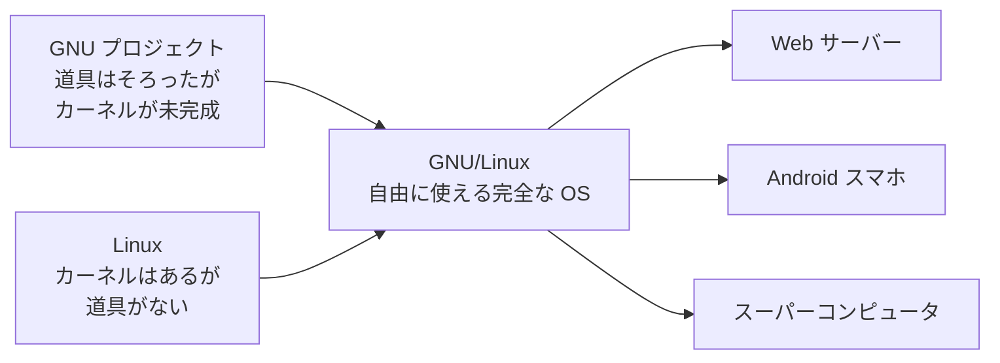

## このセクションで学ぶこと

- フィンランドの大学生の「趣味」が Linux になるまでの物語
- GNU と Linux が互いの欠けたピースを埋め合った関係
- 「バザール方式」と呼ばれるオープンな開発スタイルの強さ

## 「ただの趣味で、大きなものにはならない」

1991 年 8 月、フィンランドのヘルシンキ大学に通う 21 歳の学生リーナス・トーバルズが、ネット上の掲示板にこんな投稿をしました。

「フリーな OS を作っています。ただの趣味で、GNU みたいに大きくてプロフェッショナルなものにはなりません」

自分のパソコンで動く OS を勉強がてら自作してみたので意見がほしい——その程度の、軽い投稿でした。これが、のちに世界中のサーバーやスマートフォンを動かすことになる Linux(リナックス)の産声です。本人が「大きなものにはならない」と断言していたところに、歴史の面白さが詰まっています。

ちなみにリーナス本人は、この OS に「Freax(フリークス)」という名前を付けるつもりでした。ところが、公開用サーバーを管理していた知人がこの名前を気に入らず、置き場のフォルダ名を独断で「linux」にしてしまいます。リーナスと Unix を合わせて Linux。世界的な名前の名付け親は、実は本人ではなかったのです。

## 欠けたピース同士が出会う

前のセクションで見たとおり、GNU プロジェクトはエディタやコンパイラなど OS の道具を豊富にそろえていましたが、心臓部のカーネルだけが未完成でした。一方、リーナスが作ったのはまさにそのカーネルです。ただしカーネル単体では、人間が操作するための道具がそろっていません。

GNU には道具があってカーネルがない。Linux にはカーネルがあって道具がない。この 2 つが組み合わさったことで、誰でも自由に使える完全な OS が、ついに現実のものになりました。

## 大聖堂とバザール

Linux の本当の革命は、ソフトウェアそのものより「作り方」にあったと言われます。

それまでの常識では、OS のような巨大なソフトウェアは、少数の精鋭が綿密な設計のもと、完成するまで静かに作り込むものでした。プログラマーのエリック・レイモンドはこれを、職人が長い年月をかけて建てる「伽藍(大聖堂)」にたとえています。

ところが Linux は正反対でした。未完成のままどんどん公開し、世界中の誰でも開発に参加でき、改良案やバグ報告が毎日のように飛び交う。レイモンドはこのにぎやかな様子を人々が雑多に集まる「バザール(市場)」にたとえ、1997 年の有名な論文「伽藍とバザール」でその強さを分析しました。

バザール方式の強さを表す言葉に、「目玉の数さえ十分あれば、どんなバグも深刻ではない」というものがあります(リーナスの法則と呼ばれます)。何千人もの目でコードを見れば、誰かが必ず欠陥に気づく。閉じた精鋭チームよりも、開かれた群衆のほうが品質を高められることがある——この発見は、ソフトウェア開発の常識を塗り替えました。

## 注意点: あなたも今日、Linux を使っている

Linux はパソコン用の OS としては少数派なので、「使ったことがない」と感じる人が多いかもしれません。しかし Android スマートフォンの中身は Linux カーネルですし、Web サイトの多くは Linux のサーバーで動き、世界のスーパーコンピュータの性能ランキング上位は Linux が独占しています。趣味の投稿から 30 年あまり。私たちは知らないうちに、毎日 Linux のお世話になっているのです。

## まとめ

- Linux は 1991 年、21 歳の大学生リーナス・トーバルズが「ただの趣味」として公開した
- カーネルを欠いた GNU と、道具を欠いた Linux が組み合わさって、自由な完全な OS が完成した
- 公開しながら群衆で作る「バザール方式」が、ソフトウェア開発の常識を変えた
