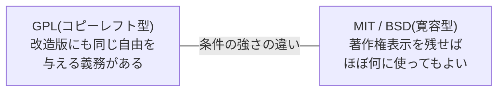

## このセクションで学ぶこと

- 無料で公開されたソフトウェアが「タダ乗り」で崩壊しない仕組み
- コピーレフトという逆転の発想と、GPL・MIT ライセンスの違い
- 「オープンソース」という言葉が生まれた経緯

## 善意だけでは守れない

GNU や Linux の物語を聞くと、こんな疑問が浮かばないでしょうか。「無料で公開したら、誰かが成果を持ち逃げして、自分の商品に閉じ込めてしまうのでは?」

実際、その心配は現実のものでした。せっかく自由に公開したコードを企業が取り込み、改造して、ソースコードを隠した製品として売る。これを許せば、自由なソフトウェアはただの「無料の素材集」になってしまいます。善意と共有の文化は、善意だけでは守れない。ここで登場するのが「ライセンス」という発明です。

## 著作権で自由を守るという逆転

ソフトウェアには、小説や音楽と同じように著作権があります。つまり、作者の許可なくコピーや改変はできないのが原則です。ライセンスとは、作者が「この条件を守るなら、コピーも改造も配布も許可します」とあらかじめ宣言しておく文書のことです。

ストールマンが考案した GPL(GNU 一般公衆ライセンス)は、この仕組みを使った見事な逆転の発想でした。GPL のソフトウェアは、自由にコピー・改造・再配布してかまいません。ただし一つだけ条件があります。「改造版を配布するなら、その改造版にも同じ自由を与えること」。つまり、GPL のコードを取り込んだソフトウェアは、ソースコードを隠して独り占めすることができないのです。自由が、コピーされるたびに連鎖していきます。

著作権(コピーライト)の力を使って、独占ではなく自由を強制する。この仕組みは「コピーレフト」と名付けられました。right(右)を left(左)にひっくり返した言葉遊びで、ここにもハッカーらしいユーモアが光ります。

## ゆるいライセンスもある

一方で、「もっと気軽に、商用製品に組み込んでもらってもかまわない」という考え方のライセンスもあります。代表が MIT ライセンスや BSD ライセンスで、おおまかに言えば「作者の名前(著作権表示)を残してくれれば、ほぼ何に使ってもよい」というゆるさです。

どちらが正しいという話ではなく、「共有の輪を法的に守りたい」のか「とにかく広く使ってほしい」のか、作者の思想の違いです。世界中の開発者が安心して他人のコードを使えるのは、この「条件が文書で明示されている」仕組みのおかげです。

## 「オープンソース」という言葉の誕生

1998 年、ブラウザ競争に敗れつつあった Netscape 社が、自社ブラウザのソースコードを公開するという驚きの決断をします。これを機に、「フリーソフトウェア」に代わるビジネス界向けの新しい呼び名として「オープンソース」という言葉が提案され、一気に広まりました。「フリー」では無料の意味に誤解され、企業に警戒されてしまうからです。

今日では Google も Microsoft もオープンソースの大口貢献者であり、かつて「自由か独占か」で激しく対立した世界は大きく様変わりしました。

## 注意点: 無料 ≠ 何でもあり

オープンソースは「著作権フリー」ではありません。ライセンス条件を破れば著作権侵害であり、実際に違反をめぐる裁判も起きています。無料で使えることと、条件なしで使えることは別物——これこそが、オープンソースが「無料でも壊れない」最大の理由です。

## まとめ

- ライセンスは「条件を守るなら自由に使ってよい」という作者の宣言で、共有文化を法的に支える発明
- GPL は著作権の力で自由の連鎖を強制する「コピーレフト」、MIT などは表示だけを求めるゆるいライセンス
- 「オープンソース」という言葉は、1998 年の Netscape のソースコード公開を機に生まれた
