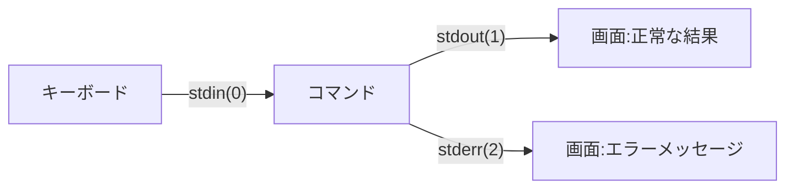

## このセクションで学ぶこと

- コマンドには stdin・stdout・stderr という **3 本の入出力の流れ**があることを理解する
- 3 本にはそれぞれ **0・1・2 という番号(ファイルディスクリプタ)** が付いていることを知る
- 正常な結果とエラーメッセージは、画面上で同じに見えても**別の流れ**であることを確認する

## 概念 — コマンドは 3 本の口を持って生まれてくる

Linux でコマンドが実行されるとき、そのコマンドには必ず **3 本の入出力の口**が用意されます。

- **標準入力(stdin)** — データを受け取る入り口。初期状態では**キーボード**につながっています
- **標準出力(stdout)** — 正常な結果を流す出口。初期状態では**画面**につながっています
- **標準エラー出力(stderr)** — エラーや警告を流す出口。これも初期状態では**画面**につながっています

図にするとこうなります。



3 本の口には番号が付いています。**stdin が 0、stdout が 1、stderr が 2** です。この番号は**ファイルディスクリプタ**と呼ばれ、後のセクションで「2 番だけファイルに流す」といった操作をするときに使います。「**2 = エラー**」だけは先に覚えておいてください。

## 具体例 — 画面では同じに見えるが、流れは別

存在するファイルと存在しないファイルを同時に `ls` してみます。

```bash
ls /etc/hosts /nonexistent
# ls: cannot access '/nonexistent': No such file or directory  ← stderr から出ている
# /etc/hosts                                                   ← stdout から出ている
```

1 行目はエラーメッセージ、2 行目は正常な結果です。どちらも同じ画面に表示されるので、一見すると「ls の出力」というひとかたまりに見えます。しかし内部では、正常な結果は stdout(1 番)、エラーは stderr(2 番)という**別々のパイプ**を通って画面に届いています。見た目は同じでも配管が違う——これがこの章全体を貫くポイントです。

stdin のほうも体験できます。`cat` を引数なしで実行してみてください。

```bash
cat
こんにちは        ← キーボードから打つ(stdin)
こんにちは        ← cat がそのまま stdout に流す
```

`cat` はファイル名を渡されないと「stdin から読む」モードになり、キーボードの入力をそのまま stdout へ流します。終わるときは `Ctrl + D`(入力の終わり)です。

## 注意点 — 「画面に出ている」だけでは区別できない

stdout と stderr はどちらも初期状態で画面につながっているため、**普段の操作では違いを意識する機会がありません**。だからこそ「出力は 1 種類だ」と思い込みやすいのですが、この区別を知らないと「結果をファイルに保存したのにエラーが入らない(または逆)」という場面で混乱します。

そしてこの 3 本の口は、初期状態の「キーボード」「画面」から**別の場所へ付け替えることができます**。それが次のセクションから学ぶ**リダイレクト**です。3 本の配管を自由につなぎ替えられるようになると、コマンドの出力をファイルに残したり、エラーだけを別の場所に集めたりできるようになります。

## まとめ

- コマンドには stdin(入力)・stdout(正常な出力)・stderr(エラー出力)の 3 本の流れがある
- 番号は stdin = 0、stdout = 1、stderr = 2。「2 = エラー」は後で効いてくる
- 正常な結果とエラーは画面上で同じに見えても別の流れ。この配管は付け替え(リダイレクト)できる
