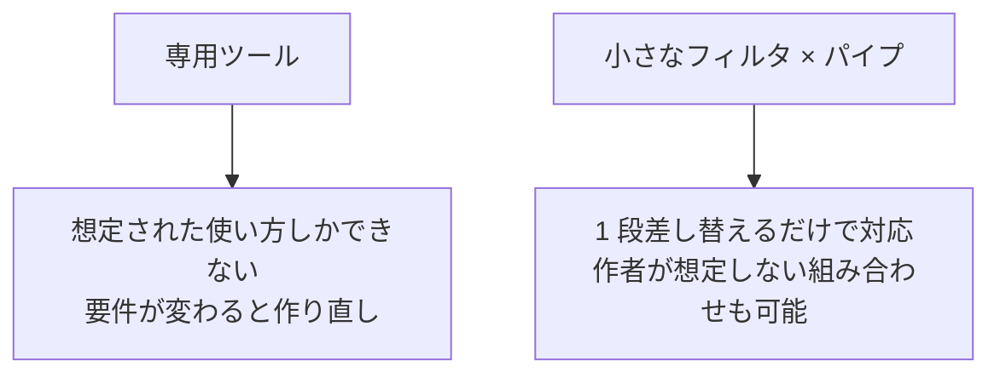

## このセクションで学ぶこと

- この章で使った道具たちの背後にある設計思想「UNIX 哲学」を知る
- 単機能の道具の組み合わせが、多機能な専用ツールより強い理由を理解する
- 「テキストが共通言語」という発想がパイプを支えていることを知る

## 一つのことをうまくやる

この章で使ったフィルタを振り返ると、奇妙なことに気づきます。`wc` には検索機能がありません。`grep` には並べ替え機能がありません。`sort` には件数を数える機能がありません。現代のアプリの感覚では「不便な未完成品」に見えますが、これは手抜きではなく**意図的な設計**です。

UNIX 哲学と呼ばれるこの思想は、よく次のように要約されます。

- **一つのことをうまくやる**プログラムを書く
- プログラム同士が**協調して動く**ように書く
- **テキストの流れ**を共通のインターフェースにする

検索は `grep` に、並べ替えは `sort` に任せればいい。各道具が単機能だからこそ入出力の形がシンプルに保たれ、パイプでどうにでも組み替えられる、という考え方です。

## 具体例 — 専用ツールとパイプラインの違い

前のセクションの「404 ランキング」を、もし**専用コマンド**として作ったらどうなるか想像してみてください。`log-ranking` という単体ツールがあったとして、要件が少し変わるたびに困ることになります。

- 「404 ではなく 500 で集計したい」→ ツールにその設定があることを祈る
- 「上位 3 件ではなく 10 件欲しい」→ 設定がなければ作者に要望を出す
- 「IP ではなくアクセス先 URL で集計したい」→ おそらく作り直し

パイプラインなら、どれも **1 段を差し替えるだけ** です。`grep " 404"` を `grep " 500"` に、`head -3` を `head -10` に、`-f 1` を別の列に変えれば終わり。部品が 6 個あれば組み合わせは並べ方次第で実質無限に増えます。機能を足して強くするのではなく、**組み合わせの自由度で強くする**。これが「小さな道具が強い理由」です。

3 つ目の柱「テキストの流れ」も効いています。どのフィルタも入出力が**行単位のテキスト**という共通言語なので、50 年前に作られた `sort` と昨日インストールしたコマンドが、お互いの存在を知らないままつながります。作者が想定していなかった組み合わせが動くのは、この共通言語のおかげです。

## 注意点 — 哲学は万能ではない

UNIX 哲学にも限界はあります。画像や JSON のような**構造を持つデータ**は、行単位のテキストとして扱うには無理があり、JSON 用には `jq` のような専用フィルタが別に生まれています。また、パイプラインが何段にも伸びて 1 行が読み切れなくなったら、それは「使い捨ての一行芸」の限界です。繰り返し使う処理は後の章で学ぶシェルスクリプトとして名前を付けて保存するのが実務の流儀です。

それでも「まず小さな道具の組み合わせで考える」習慣は、ツール選びやプログラム設計全般に効く視点として持っておく価値があります。

## まとめ

- UNIX 哲学の核は「一つのことをうまくやる」「協調して動く」「テキストの流れを共通言語にする」
- 単機能のフィルタは 1 段差し替えるだけで要件変更に対応でき、組み合わせの自由度で専用ツールに勝る
- 構造化データや長すぎるパイプラインは苦手領域。繰り返す処理はシェルスクリプトへ進む
