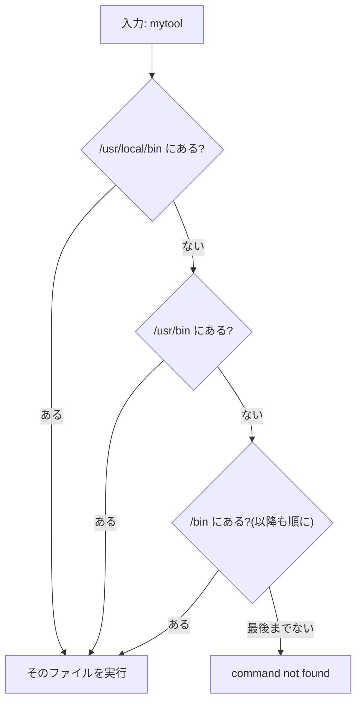

## このセクションで学ぶこと

- `ls` と打つだけでコマンドが実行できるのは `PATH` の探索のおかげであること
- `echo $PATH` と `which` で探索の中身を確認する方法
- 自分のディレクトリを `PATH` に追加する方法と、その際の落とし穴

## PATH はコマンドの「捜索リスト」

`ls` と打つと一覧が表示されますが、実際に動いているのは `/bin/ls` という実行ファイルです。フルパスを打っていないのに見つかるのはなぜでしょうか。答えが環境変数 **`PATH`** です。前のセクションで見た環境変数の中でも、`PATH` はシェルの動作の核心を握る特別な 1 つです。

```bash
echo $PATH
# /usr/local/bin:/usr/bin:/bin:/usr/sbin:/sbin
```

`PATH` の中身は **ディレクトリの一覧をコロン `:` で区切ったもの** です。コマンド名だけが入力されると、シェルはこのリストを **先頭から順に** 見ていき、同じ名前の実行ファイルが最初に見つかったディレクトリのものを実行します。



どこで見つかったのかを知りたいときは `which` を使います。

```bash
which ls      # /bin/ls
which python3 # /usr/bin/python3
which mytool  # 見つからなければ何も出ない(またはエラー)
```

つまり、よく見る `command not found` というエラーの正体は「**PATH のどのディレクトリにもその名前の実行ファイルがなかった**」という報告です。打ち間違いか、未インストールか、インストール先が PATH に入っていないか — 原因はこの 3 つに絞られます。

## 自分のディレクトリを PATH に足す

自作のスクリプトを置く `~/bin` を作り、どこからでも名前だけで呼べるようにしてみます。

```bash
mkdir -p ~/bin
export PATH="$HOME/bin:$PATH"   # 既存の PATH の先頭に追加
```

ポイントは末尾の `:$PATH` です。**既存のリストを保ったまま、自分のディレクトリを先頭に連結** しています。先頭に置いたディレクトリは探索で優先されるため、同名のコマンドがあっても自分のものが勝ちます。これで `~/bin` に置いたスクリプトは、次章で作るものも含めて名前だけで実行できるようになります。

## 注意点

- **`:$PATH` を忘れて `export PATH="$HOME/bin"` と書くと大事故です**。捜索リストが 1 件に上書きされ、`ls` すら `command not found` になります。慌てずそのターミナルを閉じて開き直せば元に戻ります(export はそのシェル限りだからです)。
- **カレントディレクトリは PATH に含まれていません**。今いる場所のスクリプトを `myscript.sh` と名前だけで実行できず `./myscript.sh` と打つのはこのためです。偽コマンドの混入を防ぐ、セキュリティ上の意図的な設計です。
- `export` での追加はそのシェルの間だけ有効です。毎回使うなら、次のセクションで扱う設定ファイルに書きます。

## まとめ

- `PATH` はコマンドを探すディレクトリの一覧(コロン区切り)で、先頭から順に探索される
- `command not found` は「PATH のどこにも見つからない」の意味。`which` で探索結果を確認できる
- 追加は `export PATH="$HOME/bin:$PATH"` の形で。`:$PATH` の付け忘れに注意
