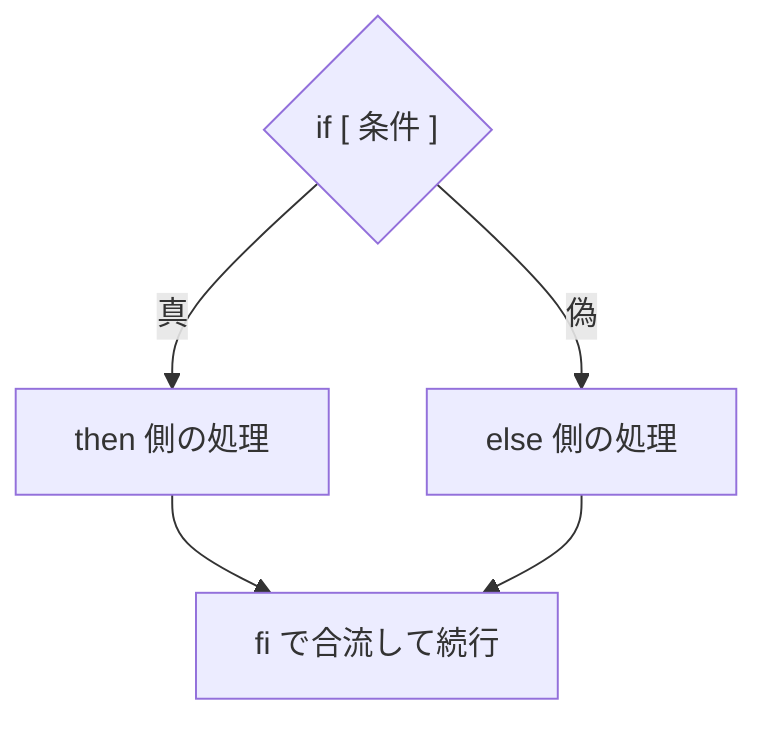

## このセクションで学ぶこと

- `if [ 条件 ]; then ... fi` による条件分岐の書き方
- `[ ]` の正体が `test` コマンドであること、空白が必須な理由
- `for ... in ...; do ... done` による繰り返しの書き方

## if — 条件によって処理を分ける

スクリプトが「考えて動く」ようになる第一歩が **if** です。基本形は `if [ 条件 ]; then 処理; fi` で、条件が真のときだけ処理が実行されます。`else` を足せば偽のときの処理も書けます。

```bash
#!/bin/bash
if [ -f "$1" ]; then
  echo "$1 はファイルとして存在します"
else
  echo "$1 が見つかりません"
fi
```



`[ ]` の中に書ける代表的な条件を挙げます。まずはこの 4 つで大半の用が足ります。

| 条件 | 真になるとき |
| --- | --- |
| `-f パス` | パスがファイルとして存在する |
| `-d パス` | パスがディレクトリとして存在する |
| `-z "$X"` | 文字列が空(引数チェックの定番) |
| `"$X" = "値"` | 文字列が一致する |

ここで大事な種明かしをひとつ。**`[` は構文記号ではなく `test` というコマンドの別名**です。つまり `[ -f "$1" ]` は「`[` コマンドに引数を渡している」だけなので、コマンドと引数の間には通常どおり **空白が必須** です。

## for — 同じ処理を繰り返す

複数の対象に同じ処理をするのが **for** です。`for 変数 in リスト; do 処理; done` の形で、リストの要素が 1 つずつ変数に入りながら処理が繰り返されます。

```bash
for name in alice bob carol; do
  echo "Hello, $name"
done
```

実務で威力を発揮するのは、ワイルドカードでファイル群を回すパターンです。

```bash
for f in *.log; do
  echo "--- $f ---"
  wc -l "$f"
done
```

前のセクションの `$@` と組み合わせて `for arg in "$@"; do ... done` と書けば、「渡された引数すべてに同じ処理」というスクリプトの定番形になります。

## 注意点

- **`[` の前後・内側の空白を忘れるのが最頻出のエラーです**。`if [-f "$1"]` と詰めて書くと `command not found` や構文エラーになります。`[` がコマンドだと思い出してください。
- `if` は `fi`、`do` は `done` で必ず閉じます。閉じ忘れると、エラー位置がわかりにくい構文エラーになります。
- ループ内でも変数は `"$f"` とダブルクォートで参照します。空白入りのファイル名対策です。

## まとめ

- `if [ 条件 ]; then ... fi` で分岐。`[` は test コマンドの別名なので空白が必須
- 条件はまず `-f`・`-d`・`-z`・`=` の 4 つを押さえれば十分
- `for 変数 in リスト; do ... done` で繰り返し。`*.log` や `"$@"` を回すのが定番
