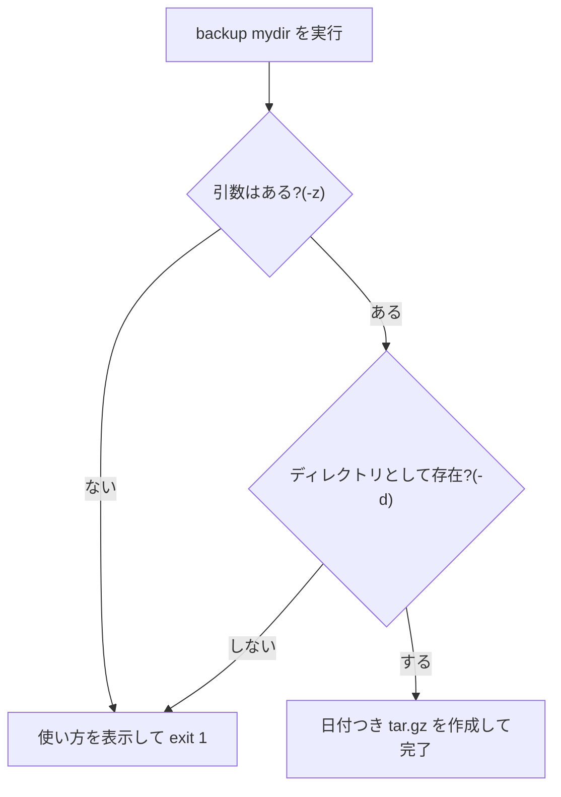

## このセクションで学ぶこと

- この章の部品(shebang・引数・if)を 1 本の実用スクリプトに組み立てる流れ
- 引数チェックとエラーメッセージで「壊れにくく」する書き方
- `exit 1` と `>&2` という失敗の作法

## 部品を組み立てる — 日付つきバックアップ

材料は揃いました。仕上げに「指定したディレクトリを、日付つきの圧縮ファイルにバックアップする」スクリプトを組んでみます。手作業なら「日付を確認して、ファイル名を考えて、tar コマンドを打つ」という数分の作業が、1 コマンドになります。

```bash
#!/bin/bash
# 使い方: backup <ディレクトリ>

if [ -z "$1" ]; then
  echo "使い方: backup <ディレクトリ>" >&2
  exit 1
fi

if [ ! -d "$1" ]; then
  echo "エラー: $1 はディレクトリではありません" >&2
  exit 1
fi

TODAY=$(date +%Y%m%d)
tar czf "backup-${TODAY}.tar.gz" "$1"
echo "backup-${TODAY}.tar.gz を作成しました"
```



中身はすべてこの章の復習です。shebang で始まり(04-01)、対象を `$1` で受け取り、`$(date ...)` で日付を変数に入れ(04-02)、`if` で実行前のチェックをしています(04-03)。`[ ! -d "$1" ]` の `!` は条件の否定で、「ディレクトリで **ない** なら」という意味になります。

注目してほしいのが失敗時の 2 つの作法です。エラーメッセージは `>&2` で **標準エラー出力** に流し(第 1 章の 3 本の流れがここで効きます)、`exit 1` で **終了コード** 1 を返して「失敗した」ことを外に伝えます。終了コードは 0 が成功、0 以外が失敗という約束で、この作法を守っておくと、将来このスクリプトを別のスクリプトや自動実行の仕組みから呼ぶときに「成功したかどうか」を機械的に判定できます。

## 自分のコマンドに昇格させる

最後に、第 3 章で PATH に追加した `~/bin` に置けば完成です。

```bash
chmod +x backup.sh
mv backup.sh ~/bin/backup
backup my-project   # どこからでも名前だけで実行できる
```

拡張子を外して `backup` という名前にしたので、見た目はもう既存コマンドと変わりません。「毎日やる手作業を、1 つずつ自分のコマンドに置き換えていく」 — これがこのカリキュラムで目指してきた自動化の入り口です。

## 注意点

- いきなり実コマンドで試さず、**まず `tar` の行を `echo` に置き換えて「何が実行されるか」を表示させてから**差し替えると安全です。削除や上書きを伴うスクリプトでは特に有効な習慣です。
- 最初から完璧を狙わないことです。今回の引数チェック程度の「壊れにくさ」から始めて、使いながら育てていけば十分です。

## まとめ

- 実用スクリプトは shebang・引数・変数・if という既習の部品の組み合わせで作れる
- 失敗時はエラーメッセージを `>&2` へ、終了コードは `exit 1` で返すのが作法
- `~/bin` に置けば自分のコマンドに昇格。手作業を 1 つずつコマンドに置き換えていく
