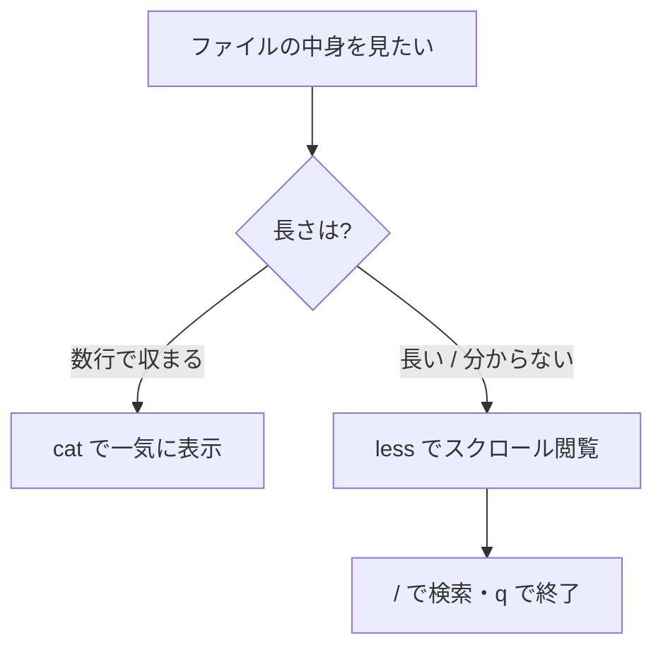

## このセクションで学ぶこと

- `cat` でファイルの中身を一気に表示する方法
- `less` で長いファイルを 1 画面ずつスクロールしながら読む方法
- 「短ければ cat、長ければ less」という実務での使い分け

## エディタを開かずに中身を読む

GUI ではファイルの中身を見るためにダブルクリックしてアプリを開きますが、CLI では「読むだけ」ならエディタすら不要です。コマンド 1 つで中身が画面に表示され、確認が終わればすぐ次の作業に移れます。この「読むだけ」を担当する定番が `cat` と `less` の 2 つです。

### cat — 全部まとめて表示する

`cat` はファイルの中身を先頭から末尾まで一気に画面へ出力します。名前は concatenate(連結する)に由来し、本来は複数のファイルをつなげて出力するためのコマンドですが、実務では「短いファイルをさっと確認する」用途で最もよく使われます。

```bash
cat /etc/hostname          # 1 行だけの短いファイルを確認
cat -n deploy.sh           # -n を付けると行番号付きで表示
cat error.log access.log   # 複数ファイルを連結して表示
```

実行するとすぐにプロンプトへ戻るので、設定ファイルやスクリプトの中身を数秒で確認できます。

### less — 1 画面ずつ読む(ページャ)

数百行あるログファイルを `cat` すると、中身が一瞬で画面を流れて末尾しか読めません。そこで使うのが `less` です。`less` は「ページャ」と呼ばれる種類のプログラムで、長いテキストを 1 画面分ずつ区切って表示し、キー操作で前後に移動できます。

```bash
less /var/log/syslog
```

`less` の中でよく使うキー操作は次のとおりです。

| キー | 動作 |
| --- | --- |
| Space / b | 1 画面進む / 戻る |
| j / k | 1 行下 / 上に移動 |
| /文字列 | 下方向に検索(n で次の一致へ) |
| g / G | 先頭 / 末尾へジャンプ |
| q | less を終了する |

最初に覚えるべきは **q で終了** です。`less` を開いたまま「戻れなくなった」と慌てるのは初学者の定番なので、まず q だけ覚えてしまいましょう。

### 使い分けの目安



迷ったら `less` を選んでおけば安全です。短いファイルでも `less` で開けますし、長いファイルが画面を流れてしまう事故も起きません。

## 注意点

- **バイナリファイルを cat しない**: 画像や実行ファイルなど文字でないデータを `cat` すると、端末の表示が乱れることがあります。乱れてしまったときは `reset` と入力すると直ります。
- **巨大なファイルに cat を使わない**: 全部出力し終わるまで止まらないため、数十万行のログなどでは時間と画面を浪費します。`less` なら先頭部分だけが即座に表示されます。

## まとめ

- `cat` はファイルの中身を一気に表示する。短いファイルの確認に最適
- `less` は 1 画面ずつ読むページャ。検索は `/`、終了は `q`
- 迷ったら `less`。長さが分からないファイルでも安全に開ける
