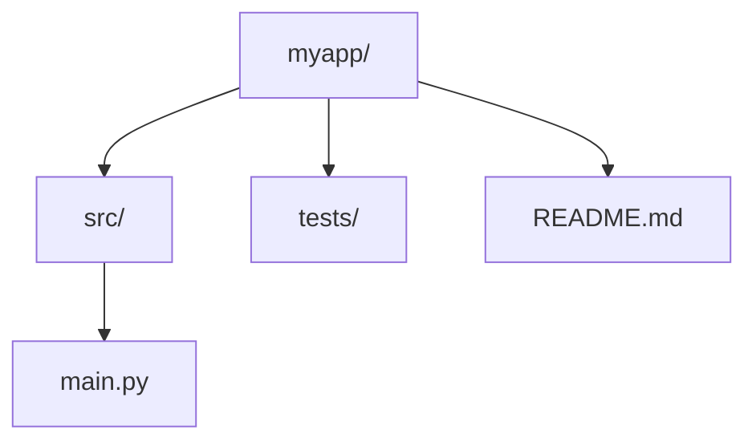

## このセクションで学ぶこと

- `mkdir` でディレクトリを作り、`-p` で深い階層をまとめて作る方法
- `touch` で空ファイルを作る方法と、その本来の役割
- プロジェクトの雛形を CLI だけで素早く用意する流れ

## 「置き場所」と「中身の器」を作る

ファイル操作の最初の動詞は「作る」です。Linux では、ディレクトリ(置き場所)を作るのが `mkdir`、空のファイル(中身の器)を作るのが `touch` という分担になっています。どちらも数文字打つだけで終わるため、GUI で右クリックして「新規作成」を選ぶよりずっと速く、慣れると戻れなくなる操作です。

### mkdir — ディレクトリを作る

`mkdir` は make directory の略で、指定した名前のディレクトリを作ります。

```bash
mkdir docs                       # docs ディレクトリを作る
mkdir logs tmp backup            # 複数まとめて作る
mkdir -p src/components/buttons  # 深い階層を一度に作る
```

ポイントは 3 行目の `-p` オプションです。`mkdir src/components/buttons` を `-p` なしで実行すると、途中の `src` や `components` が存在しない場合にエラーになります。`-p` を付ければ、必要な中間ディレクトリをまとめて作ってくれます。

### touch — 空ファイルを作る

`touch` は、指定した名前のファイルが存在しなければ空のファイルを作ります。

```bash
touch README.md            # 空の README.md を作る
touch memo.txt todo.txt    # 複数まとめて作る
```

実は `touch` の本来の役割は「ファイルのタイムスタンプ(最終更新日時)を現在時刻に更新する」ことです。対象が存在しないときに空ファイルが作られるのはおまけの動きなのですが、実務ではこちらの使い方のほうが圧倒的に多くなっています。逆に言えば、既存のファイルに `touch` しても中身は一切変わりません。うっかり実行しても壊れない、安全なコマンドです。

### 実務例 — プロジェクトの雛形を 30 秒で作る

`mkdir` と `touch` を組み合わせると、新しいプロジェクトの骨組みを一気に用意できます。

```bash
mkdir -p myapp/src myapp/tests
touch myapp/README.md myapp/src/main.py
```

この 2 行で、次の構造ができあがります。



## 注意点

- **mkdir は既存の名前を指定するとエラー** になります。`-p` を付けると「すでにあるなら何もしない」という動きになるため、スクリプトの中では `-p` 付きが定番です。
- **存在しないディレクトリの中には touch できません**。`touch src/main.py` は `src` がないとエラーになるので、先に `mkdir` してください。
- **ファイル名にスペースを入れない** のが CLI の慣習です。`my file.txt` のような名前は引用符で囲む必要が生じて扱いづらいため、`my-file.txt` や `my_file.txt` のようにつなげましょう。

## まとめ

- ディレクトリは `mkdir`、深い階層は `-p` でまとめて作る
- `touch` は空ファイルを作る(本来はタイムスタンプ更新で、既存の中身は壊さない)
- 2 つを組み合わせれば、プロジェクトの雛形が数行で用意できる
