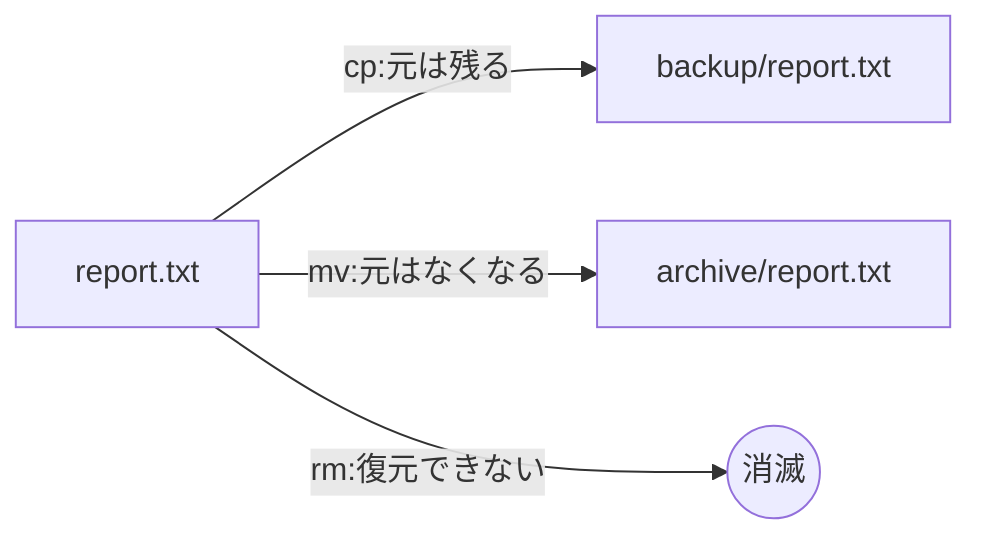

## このセクションで学ぶこと

- `cp`(写す)・`mv`(動かす)・`rm`(消す)の基本的な使い方
- 「改名」が `mv` で行われる理由
- CLI には「ゴミ箱」も「元に戻す」もない、というリスクとの付き合い方

## ファイル操作の三大動詞

ファイルを扱う日常作業の大半は、「コピーする」「移動する」「削除する」の 3 つに集約されます。Linux ではそれぞれ `cp`(copy)、`mv`(move)、`rm`(remove)という短い動詞が割り当てられています。どれも「コマンド 対象 (行き先)」という同じ語順なので、1 つ覚えれば残りも同じ感覚で使えます。

### cp — 写す

```bash
cp report.txt backup.txt        # report.txt を backup.txt という名前で複製
cp report.txt backup/           # backup ディレクトリの中へコピー
cp -r project/ project-backup/  # ディレクトリごとコピーするには -r が必要
```

`cp` の後ろは「元 → 先」の順です。ディレクトリを丸ごとコピーするときは `-r`(recursive、再帰的に)を付けます。

### mv — 動かす(改名も同じ)

```bash
mv report.txt archive/      # archive ディレクトリへ移動
mv draft.txt report.txt     # draft.txt を report.txt に改名
```

`mv` には「移動」と「改名」の 2 つの顔がありますが、Linux から見ればどちらも「ファイルの場所(パス)を付け替える」という同じ操作です。行き先を `archive/report.txt` にすれば移動、同じ場所の `report.txt` にすれば改名、というだけの違いです。

### rm — 消す

```bash
rm old.txt           # ファイルを削除
rm -r old-project/   # ディレクトリごと削除
rm -i *.log          # 1 件ずつ確認しながら削除
```

3 つの動詞の効果を図にすると次のようになります。



## 注意点 — ゴミ箱はない

ここがこのセクションで一番大事な話です。GUI の削除はゴミ箱へ移すだけなので後から戻せますが、**`rm` はゴミ箱を経由せず、その場でファイルを消します**。「元に戻す」操作も存在しません。さらに、`cp` や `mv` で行き先に同名のファイルがあると、**警告なしで上書き** されます。

特に危険なのが `rm -rf` です。`-f`(force)は確認をすべて省略するオプションで、`-r` と組み合わせるとディレクトリツリーを問答無用で消し去ります。たとえば `rm -rf ~/tmp` と打つつもりが、スペースの位置を誤って `rm -rf ~ /tmp` と打ってしまうと、ホームディレクトリ全体が削除対象になります。タイプミス 1 つが取り返しのつかない事故になる、CLI で最も有名な危険コマンドです。

実務での自衛策は次の 3 つです。

- 削除や上書きの前に `ls` で対象を確認する(特にワイルドカード `*` を使うとき)
- 自信がないうちは `-i` を付けて 1 件ずつ確認する(`rm -i`・`cp -i`・`mv -i`)
- 大事なデータは消す前に `cp` でバックアップを取っておく

## まとめ

- `cp` は写す、`mv` は動かす(改名も同じ操作)、`rm` は消す
- `rm` にゴミ箱はなく、`cp`・`mv` の上書きにも警告は出ない
- ワイルドカードや `-rf` を使う前は `ls` で対象を確認する習慣をつける
