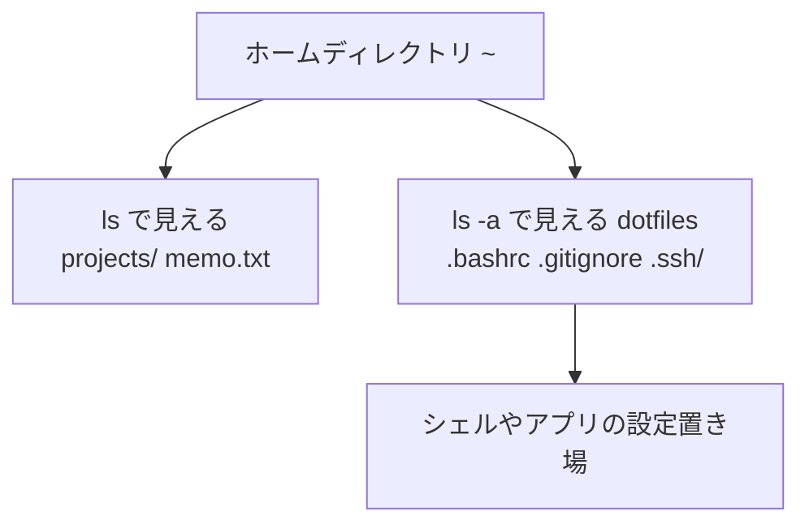

## このセクションで学ぶこと

- 隠しファイルは「名前が `.` で始まる」だけの普通のファイルであること
- 隠しファイルが設定ファイルの置き場(dotfiles)として使われる慣習
- `ls -a` での確認方法と、ワイルドカード操作での落とし穴

## 「隠しファイル」の正体は名前のルール

ホームディレクトリで `ls` を実行しても見えないのに、確かに存在しているファイルたちがいます。それが隠しファイルです。といっても、特別な「隠し属性」のような仕組みがあるわけではありません。Linux の隠しファイルは、**名前が `.`(ドット)で始まる、それだけ** です。`ls` をはじめ多くのツールが「`.` で始まる名前はデフォルトで表示しない」という慣習に従っているにすぎず、ファイルとしての中身や扱いは普通のファイルとまったく同じです。

```bash
ls ~        # 通常の表示。隠しファイルは見えない
ls -a ~     # -a(all)で . から始まるファイルも表示
ls -la ~    # 詳細情報付きで全部表示(よく使う組み合わせ)
```

`ls -a` の出力には `.`(現在のディレクトリ自身)と `..`(親ディレクトリ)も含まれます。この 2 つはどのディレクトリにも必ずある特殊な名前です。

### dotfiles — 設定ファイルの定位置

`.` で始まるファイルは慣習的に **dotfiles** と呼ばれ、アプリケーションやシェルの設定置き場として使われます。ホームディレクトリでよく見かける代表例を挙げます。

| dotfile | 役割 |
| --- | --- |
| `.bashrc` | bash シェルの設定(エイリアスや環境変数など) |
| `.gitignore` | Git にバージョン管理させないファイルの指定 |
| `.ssh/` | SSH の鍵や接続設定をまとめたディレクトリ |
| `.config/` | 各種アプリの設定をまとめる現代的な置き場 |

普段の `ls` で設定ファイルが見えないおかげで、作業中のファイル一覧がすっきり保たれる、というのがこの慣習の実用的なメリットです。エンジニアが自分の設定ファイル一式を「my dotfiles」として GitHub で公開する文化もあり、dotfiles は単なる隠しファイル以上に「自分の環境カスタマイズの蓄積」を指す言葉にもなっています。



## 注意点

- **隠しファイルは秘密ではありません**。`ls -a` さえ打てば誰でも見えるので、見られて困る情報を「隠す」目的には使えません(それは後の章で学ぶ「権限」の仕事です)。
- **ワイルドカード `*` は隠しファイルにマッチしません**。`cp src/* dest/` のようなコピーでは dotfiles だけ取り残されるため、ディレクトリごと `cp -r src/ dest/` とするのが安全です。
- **`rm -r .*` のような削除は危険** です。`.*` は `..`(親ディレクトリ)にもマッチしうるため、思わぬ範囲を巻き込みます。dotfiles を消すときは `.bashrc` のように名前を直接指定しましょう。

## まとめ

- 隠しファイルは「名前が `.` で始まる」だけの普通のファイル。`ls -a` で見える
- dotfiles はシェルやアプリの設定置き場という慣習で、`.bashrc` などが代表例
- 隠すことはセキュリティではない。`*` や `.*` を使った一括操作では取りこぼしと巻き込みに注意
