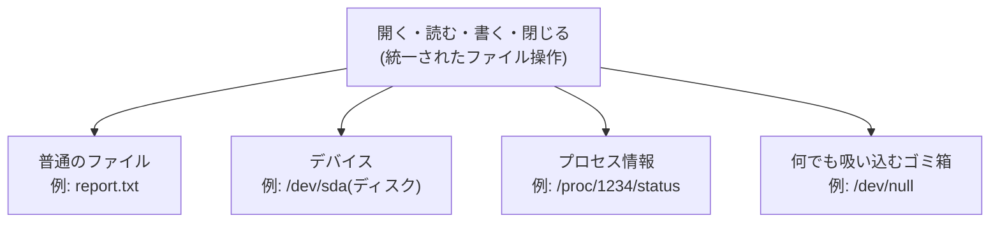

## このセクションで学ぶこと

- 「すべてはファイル」という Linux の設計思想がどういう意味なのかを理解する
- `/dev` や `/proc` に並ぶ「ファイルに見えるもの」の正体を知る
- 操作が統一されていることが、実務でどう役立つのかを知る

## 「すべてはファイル」とは何か

Linux(およびその源流である UNIX)には、有名な設計思想があります。それが「すべてはファイル(Everything is a file)」です。

ここで言う「すべて」は誇張ではありません。文書や画像のような普通のファイルだけでなく、**ハードディスク、キーボード、画面、さらには実行中のプロセスの情報まで**、Linux ではファイルと同じ姿で扱えるようになっています。

なぜそうしたのでしょうか。理由はシンプルで、**操作のインターフェースを 1 種類に統一できる**からです。「開く・読む・書く・閉じる」というファイル操作さえ覚えれば、相手がディスクでもプロセス情報でも、同じ流儀でアクセスできます。対象ごとに専用の操作方法を覚える必要がないのです。



## 具体例 — /dev と /proc をのぞいてみる

実際にこの思想が形になっている場所を見てみましょう。まずはデバイスが並ぶ `/dev` です。

```bash
ls /dev
# null  random  sda  tty  zero  ...(環境により異なります)
```

ここに並ぶ `sda` はディスク、`tty` は端末を表す「デバイスファイル」です。中でも有名なのが `/dev/null` で、**書き込んだものをすべて捨てる仮想的なゴミ箱**として使われます。不要な出力を `/dev/null` に「書き込む」ことで黙らせる、という使い方を実務で頻繁に見かけます。

次に `/proc` です。ここには実行中のプロセスやカーネルの情報が、仮想的なファイルとして並んでいます。

```bash
cat /proc/cpuinfo
# processor : 0
# model name : ...(CPU の情報が表示される)
```

`cpuinfo` という名前のファイルを `cat` で読んだだけなのに、CPU の情報が出てきました。これはディスク上に実体があるファイルではなく、**読まれた瞬間にカーネルが中身を生成している**仮想ファイルです。それでも `cat` という「ファイルを読むコマンド」がそのまま使える——これが統一のメリットです。

## 注意点 — 「ファイルに見える」だけで中身は別物

気をつけたいのは、ファイルに見えるからといって普通のファイルと同じ性質を持つわけではない、ということです。

- `/proc` 配下のファイルはディスク上に存在せず、サイズが 0 と表示されることもあります。コピーして保存しても「その瞬間のスナップショット」にしかなりません。
- `/dev` 配下のデバイスファイルをむやみに書き換えるのは危険です。たとえば `/dev/sda` への直接書き込みはディスクの内容を壊し得ます。読む分には安全でも、書く操作は慎重に。

とはいえ初級のうちは、「Linux ではいろいろなものがファイルの顔をして並んでいて、同じコマンドで触れる」という感覚をつかめれば十分です。この感覚は、次の章で扱うプロセスや、リダイレクトといった仕組みを学ぶときの土台になります。

## まとめ

- Linux は「すべてはファイル」という思想で、デバイスもプロセス情報もファイルとして扱う
- `/dev` にはデバイスファイル、`/proc` にはプロセスやカーネルの仮想ファイルが並び、`cat` など普通のコマンドで読める
- ファイルに見えても実体は別物。特にデバイスファイルへの書き込みは慎重に
