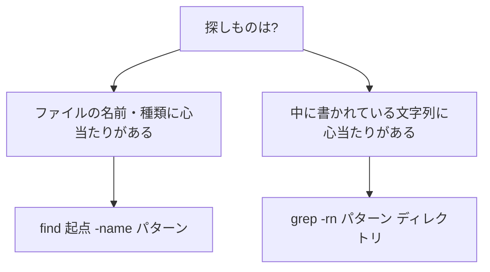

## このセクションで学ぶこと

- `grep` の基本形「`grep パターン ファイル`」でファイルの中身を検索できるようになる
- `-i`・`-n`・`-r` など、実務で頻出のオプションを使う
- `find`(名前で探す)と `grep`(中身で探す)の使い分けを整理する

## grep の考え方 — 行単位の検索器

前のセクションの `find` は「ファイルの名前」で探すコマンドでした。一方、「エラーメッセージがどのログに書かれているか知りたい」「この設定項目はどのファイルにあるのか」のように、**中身**を手がかりに探したい場面も多くあります。それが `grep` の出番です。

`grep` は、ファイルを 1 行ずつ調べて、**指定したパターンを含む行だけを表示する**コマンドです。基本形は次のとおりです。

```bash
grep パターン ファイル
```

「何を探すか」が先、「どこから探すか」が後。`find` とは語順が逆である点に注意してください。

## 具体例 — ログからエラー行を抜き出す

ログファイルから `error` を含む行を探してみましょう。

```bash
grep "error" app.log
# 2026-06-12 10:03:21 error: connection refused
# 2026-06-12 10:15:02 error: timeout
```

何百行あるログでも、目的の行だけが抜き出されます。ここに実務で定番のオプションを足していきます。

```bash
grep -i "error" app.log    # -i: 大文字小文字を区別しない(Error も ERROR も拾う)
grep -n "error" app.log    # -n: 行番号付きで表示する
grep -rn "timeout" ./app   # -r: ディレクトリ配下をまとめて再帰検索
```

特に `-r` は強力で、「このディレクトリのどこかに書いてあるはず」というときに、ファイルを 1 つずつ開かずに横断検索できます。`-rn` のように組み合わせれば「どのファイルの何行目か」まで一発でわかり、コードや設定ファイルの調査が一気に速くなります。

`find` との使い分けはこう整理できます。



## 注意点 — パターンは「ただの文字列」ではない

`grep` のパターンは正規表現として解釈されます。たとえば `.` は「任意の 1 文字」を意味するため、`grep "1.0" file` は `1.0` だけでなく `100` にも一致します。最初のうちは「`.` や `*` などの記号は特別な意味を持つことがある」と頭の片隅に置き、記号を含む検索で結果が変なときは正規表現を疑ってください(正規表現そのものは後のカリキュラムで扱います)。

もう 1 つ、パターンに**スペースを含むときは引用符で囲む**ことを忘れずに。囲まないと、スペースの後ろがファイル名として解釈されてしまいます。

## まとめ

- `grep` は「`grep パターン ファイル`」で、パターンに一致する行を抜き出す。語順は `find` と逆
- `-i`(大文字小文字無視)・`-n`(行番号)・`-r`(再帰検索)が実務の定番。`grep -rn` で「どのファイルの何行目か」まで特定できる
- 名前で探すなら `find`、中身で探すなら `grep`。パターン内の記号は正規表現として解釈される点に注意
