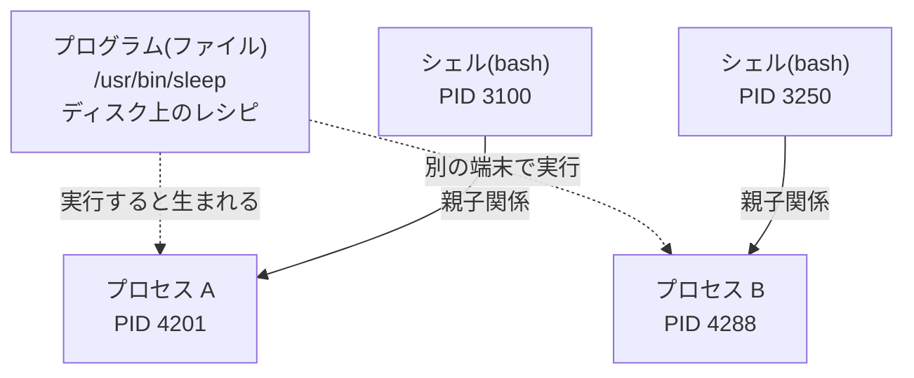

## このセクションで学ぶこと

- プログラム(ディスク上のファイル)とプロセス(実行中の実体)の違いを理解する
- プロセスを一意に識別する番号 **PID** の役割を知る
- プロセスには親子関係があり、シェルを親として次々に生まれることを知る

## プログラムとプロセスは別物

`ls` や `cat` のようなコマンドの実体は、ディスク上に置かれた **プログラムファイル**(たとえば `/usr/bin/ls`)です。これは料理にたとえると **レシピ** にあたります。書かれているだけでは何も起きません。

このレシピをもとに実際に調理が始まったもの、つまり **実行されてメモリ上で動き出した実体** を **プロセス** と呼びます。コマンドを打つたびにプロセスが生まれ、仕事を終えると消えていきます。

重要なのは、**1 つのプログラムから複数のプロセスが同時に生まれられる**ことです。ターミナルを 2 枚開いてそれぞれで `less` を動かせば、プログラムファイルは 1 つでも、プロセスは 2 つ存在します。そこで Linux のカーネルは、生まれたプロセス 1 つ 1 つに **PID(Process ID)** という一意の番号を割り振って区別します。

もう 1 つの骨格が **親子関係** です。プロセスは無から湧くのではなく、必ず別のプロセスが生み出します。あなたがシェルでコマンドを打つと、シェル(bash など)が **親プロセス** となって子プロセスを生み、子が終了すると親に制御が戻ります。



## 具体例 — 自分のシェルも 1 つのプロセス

いまコマンドを受け付けているシェル自身も、プロセスの 1 つです。シェルの PID は `$$` という特殊な変数で確認できます。

```bash
echo $$
# 3100   ← いま使っているシェル自身の PID(値は環境ごとに異なります)
```

前の章で見た「すべてはファイル」を思い出してください。`/proc` の下には、**PID と同じ名前のディレクトリ** が並んでいて、各プロセスの情報をファイルとして読めます。

```bash
ls /proc/3100/
# cmdline  cwd  environ  status  ...
cat /proc/3100/status
# Name:  bash
# Pid:   3100
# PPid:  3050   ← このシェルの「親」の PID
```

`PPid`(Parent PID)という行があるとおり、シェルにも親がいます。親をたどっていくと、最終的にシステム起動時に生まれる PID 1 のプロセス(init や systemd)に行き着きます。つまり Linux で動くすべてのプロセスは、PID 1 を頂点とする 1 本の家系図(木構造)につながっています。

## 注意点 — PID は「使い回される」

PID はプロセスが消えると回収され、いずれ **別のプロセスに再利用されます**。「昨日メモした PID 4201 を今日も使う」といった運用は危険で、まったく別のプロセスを指している可能性があります。PID は **その都度確認してから使う** のが鉄則です。確認の道具が、次のセクションで学ぶ `ps` と `top` です。

また、プログラムとプロセスが別物である以上、「プログラムファイルを消しても、すでに動いているプロセスはすぐには止まらない」「プロセスを止めてもファイルは消えない」という関係も押さえておきましょう。

## まとめ

- プログラムはディスク上のレシピ、プロセスはそれが実行されて動いている実体。1 つのプログラムから複数のプロセスが生まれる
- 各プロセスには一意の PID が付き、`/proc/{PID}/` からその情報をファイルとして読める
- プロセスには親子関係があり、すべては PID 1 を頂点とする木構造。PID は再利用されるため、使う前にその都度確認する
