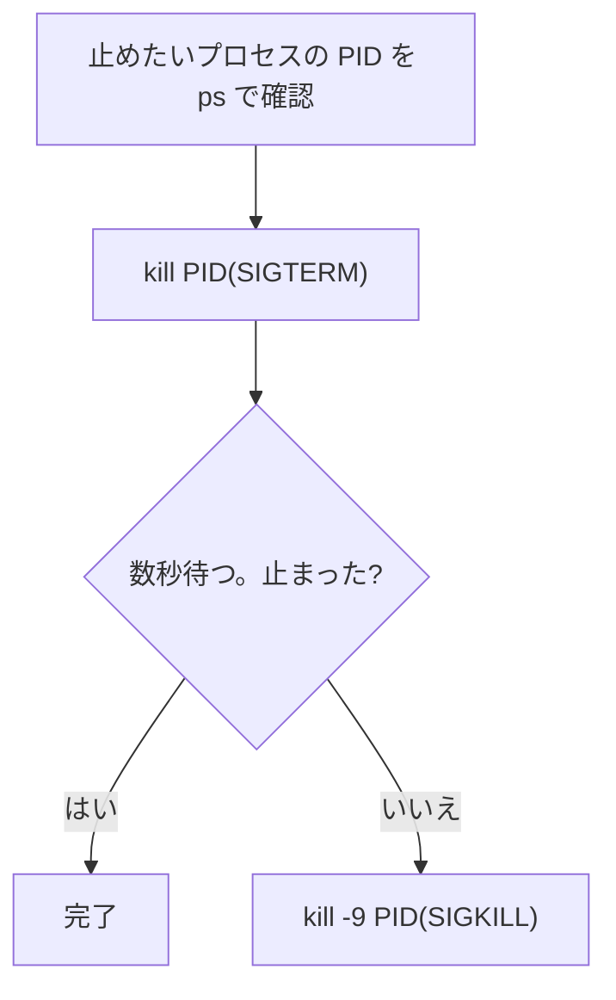

## このセクションで学ぶこと

- `kill` は「殺す」ではなく「**シグナルを送る**」コマンドだと理解する
- SIGTERM(15)と SIGKILL(9)の違いと、使う順番を知る
- いつも使っている Ctrl+C も、実は SIGINT というシグナルだと知る

## kill の正体はシグナルの送信係

暴走したプロセスや、間違って起動したプロセスを止めるコマンドが `kill` です。物騒な名前ですが、実体は「プロセスに **シグナル**(番号付きの通知)を送る」コマンドにすぎません。送るシグナルの種類によって、伝わる内容が変わります。代表は 2 つだけ覚えれば十分です。

- **SIGTERM(15)** — 「終了してください」という **依頼**。`kill` の既定値。受け取ったプロセスは、ファイルの保存や接続のクローズといった後片付けをしてから終了できます。
- **SIGKILL(9)** — 問答無用の **強制終了**。プロセス本人には拒否も後片付けもできず、カーネルが直接止めます。

```bash
kill 4201        # SIGTERM(15)を送る。まずはこちら
kill -9 4201     # SIGKILL を送る。効かないときの最後の手段
```

作法は「**まず TERM、待っても駄目なら KILL**」です。



## 具体例 — sleep を止めてみる

安全に練習するには、何もせず待つだけの `sleep` が最適です。ターミナルを 2 枚開き、1 枚目で長い sleep を動かします。

```bash
sleep 1000
# (プロンプトが返ってこない=フォアグラウンドで動いている)
```

2 枚目の端末で PID を調べ、シグナルを送ります。

```bash
ps aux | grep sleep
# riki  4201  0.0  0.0 ... sleep 1000
kill 4201
```

1 枚目の端末に `Terminated` と表示され、プロンプトが返ってくれば成功です。

ここで種明かしをひとつ。これまで「処理を中断したいときは Ctrl+C」と使ってきましたが、あれは **フォアグラウンドのプロセスに SIGINT(割り込み、番号 2)を送る操作** です。つまりあなたはすでに、キーボードからシグナルを送っていたのです。

## 注意点 — いきなり kill -9 しない

`kill -9` は確実に止まる反面、後片付けを完全にスキップします。書きかけのファイルが壊れたり、一時ファイルやロックが残って次回起動に失敗したりすることがあります。「まず `kill`(TERM)→ 数秒待つ → 駄目なら `-9`」の順番を守りましょう。

また、シグナルを送れるのは **原則として自分のプロセスだけ** です。他のユーザーやシステムのプロセスに送ろうとすると権限エラーになります(誰に何が許されるかは、次章「権限」で扱います)。PID の打ち間違いにも注意してください。前のセクションで見たとおり PID は使い回されるため、**kill の直前に ps で確認し直す** のが安全です。

## まとめ

- `kill` はシグナルの送信係。既定の SIGTERM(15)は「終了の依頼」で、後片付けの猶予がある
- 止まらないときだけ `kill -9`(SIGKILL)。後片付けをスキップするため最後の手段にする
- Ctrl+C も SIGINT というシグナル。送る前に `ps` で PID を確認し直すのが作法
