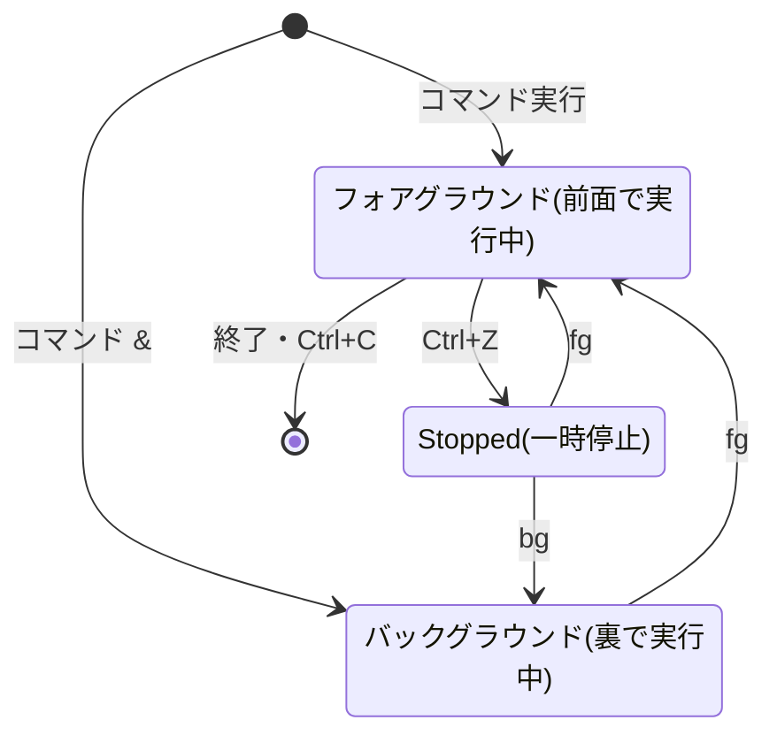

## このセクションで学ぶこと

- **フォアグラウンド**(端末の前面を占有)と **バックグラウンド**(裏で実行)の違いを理解する
- 末尾の `&` でバックグラウンド起動し、`jobs`・`fg`・`bg` で前後を行き来できるようになる
- Ctrl+Z は「終了」ではなく「**一時停止**」だと理解する

## 端末の「前」と「後ろ」

これまでコマンドを実行すると、終わるまでプロンプトが返ってきませんでした。これはプロセスが端末の前面を占有する **フォアグラウンド** で動いていたからです。前面に立てるプロセスは 1 つの端末につき 1 つだけで、キーボード入力(Ctrl+C を含む)はそのプロセスに届きます。

しかし、時間のかかる処理の間ずっと待つのは不便です。そこで、端末を占有せず裏側で動かす **バックグラウンド** という実行のさせ方があります。コマンドの末尾に `&` を付けるだけです。

```bash
sleep 300 &
# [1] 4521
```

すぐにプロンプトが返り、`[1]` という **ジョブ番号** と PID(4521)が表示されます。ジョブとはシェルが管理する作業の単位で、`jobs` で一覧できます。

前後の行き来と一時停止の関係は、状態遷移として見ると整理しやすくなります。



## 具体例 — 「うっかり前面で始めてしまった」を救う

実務でいちばん多いのはこの場面です。長い処理をうっかりフォアグラウンドで始めてしまい、端末が塞がった——そこで **Ctrl+Z** を押すと、プロセスは **一時停止(Stopped)** してプロンプトが返ってきます。

```bash
sleep 300
# ここで Ctrl+Z を押す
# [1]+  Stopped                 sleep 300
```

止まったままでは処理が進まないので、`bg` で **裏側で再開** します。

```bash
bg %1
# [1]+ sleep 300 &
jobs
# [1]+  Running                 sleep 300 &
```

`%1` はジョブ番号 1 の指定です。これで端末を使いながら処理も進む状態になりました。前面に戻したくなったら `fg` です。

```bash
fg %1
# sleep 300(前面に戻る。Ctrl+C で終了できる)
```

「Ctrl+Z で止める → `bg` で裏に回す」「`fg` で前に呼び戻す」。この 2 つの動線を体で覚えると、端末 1 枚でも作業の自由度が大きく上がります。

## 注意点 — Ctrl+Z は止めたことにならない

Ctrl+Z を Ctrl+C と混同して「終了した」と思い込むのが定番の落とし穴です。実際には Stopped のままプロセスが残っていて、メモリも使い続けます。心当たりがあるときは `jobs` で確認し、不要なら `kill %1` のようにジョブ番号でも止められます。

もう 1 つ、バックグラウンドのジョブは **その端末のシェルの子プロセス** なので、端末を閉じると一緒に終了するのが基本です。端末を閉じても処理を残したい場合は `nohup` などの道具がありますが、ここでは「`&` だけでは端末を閉じたら消える」と覚えておけば十分です。ジョブ番号(%1)と PID は別物である点にも注意してください。

## まとめ

- フォアグラウンドは端末を占有、バックグラウンドは裏で実行。末尾の `&` で最初から裏で起動できる
- Ctrl+Z は一時停止(Stopped)。`bg` で裏で再開、`fg` で前面に戻す。状況確認は `jobs`
- Ctrl+Z は終了ではない。また `&` のジョブは端末を閉じると消えるのが基本(残すなら nohup などが入り口)
