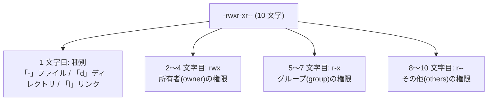

## このセクションで学ぶこと

- `ls -l` の行頭 10 文字を「種別 1 文字 + rwx × 3 区分」に分解して読める
- r・w・x の意味がファイルとディレクトリで異なることを理解する
- 自分にどの区分の権限が適用されるかを判断できる

## 行頭 10 文字の構造 — 1 + 3 + 3 + 3

前のセクションで、権限(パーミッション)は「所有者・グループ・その他」の 3 区分で決まると学びました。その設定内容は `ls -l` の行頭に表示される `-rwxr-xr--` のような 10 文字に、すべて書かれています。

一見すると暗号のようですが、構造は単純です。**先頭の 1 文字がファイルの種別、残りの 9 文字が 3 文字ずつ 3 区分の権限**を表しています。



各区分の 3 文字は、左から **r(read: 読み)・w(write: 書き)・x(execute: 実行)** の順で固定されており、許可されていない操作は `-` になります。たとえば `r-x` なら「読みと実行はできるが、書き換えはできない」という意味です。

## 具体例 — 1 行を読み解く

実際の出力を読んでみましょう。

```bash
ls -l report.txt
# -rw-r--r-- 1 alice developers 1024 Jun 13 10:00 report.txt
```

権限の後ろに並ぶ `alice` が**所有者**、`developers` が**グループ**です。行頭を分解すると次のようになります。

- `-` — 普通のファイル
- `rw-` — 所有者 alice は読み書きできる(実行は不可)
- `r--` — developers グループのメンバーは読むだけ
- `r--` — その他の全員も読むだけ

では、自分にはどの区分が適用されるのでしょうか。判定は**左から順に「最初に当てはまった区分だけ」**が使われます。自分が所有者なら所有者の 3 文字だけ、所有者でなくグループのメンバーならグループの 3 文字だけ、どちらでもなければその他の 3 文字だけを見ます。

## ディレクトリでは意味が変わる

同じ rwx でも、**ディレクトリに付いている場合は意味が変わる**点に注意が必要です。

- **r** — 中の一覧を見られる(`ls` できる)
- **w** — 中にファイルを作ったり消したりできる
- **x** — 中に入れる(`cd` できる、中のファイルにアクセスできる)

ディレクトリを「ファイル名が並んだ台帳」と考えると覚えやすいでしょう。r は台帳を読む、w は台帳に書き加える・消す、x は台帳の先へ進む権限です。

ここから、初学者がつまずきやすい事実が 1 つ導けます。**ファイルを削除できるかどうかは、ファイル自身の w ではなく「親ディレクトリの w」で決まる**のです。削除とは「台帳から名前を消す」操作だからです。「書き込み禁止のファイルなのに消せてしまった」という不思議な現象は、これが理由です。

もう 1 つの注意点として、ディレクトリの実行権限(x)がないと、たとえ r があっても中のファイルは開けません。「一覧は見えるのに中身に届かない」状態になります。ディレクトリには通常 r と x をセットで付ける、と覚えておけば十分です。

## まとめ

- 行頭 10 文字は「種別 1 文字 + 所有者・グループ・その他の rwx 各 3 文字」に分解して読む
- 適用されるのは左から最初に当てはまった 1 区分だけ
- ディレクトリの rwx は「一覧・作成と削除・中に入る」を意味し、ファイルの削除可否は親ディレクトリの w で決まる
