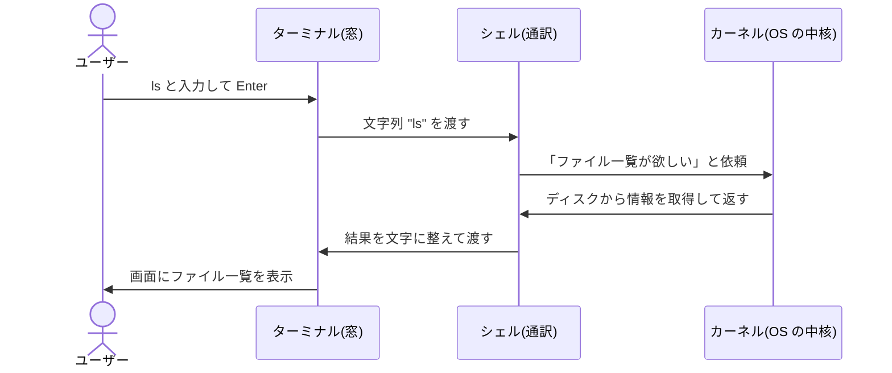

## このセクションで学ぶこと

- ターミナル・シェル・カーネルという 3 つの言葉の役割の違い
- コマンドが「ターミナル → シェル → カーネル」の順に伝わる流れ
- bash や zsh は「シェルの種類」の名前であること

## 3 つの登場人物

「黒い画面」まわりの用語は混同されがちです。ターミナル、シェル、bash、カーネル……どれも似た文脈で登場しますが、役割はきれいに分かれています。登場人物は大きく 3 つです。

**ターミナル(端末)** は、文字を表示し、キーボード入力を受け取る「窓」のアプリです。macOS のターミナル.app や Windows Terminal がこれにあたります。ターミナル自身はコマンドの意味を理解しません。文字を右から左へ運ぶだけの存在です。

**シェル** は、ターミナルから渡された文字列をコマンドとして解釈するプログラムです。`ls` と打たれたら「ファイル一覧を表示したいのだな」と理解し、OS に処理を依頼します。人間の言葉を OS に取り次ぐ「通訳」だと考えてください。シェルには種類があり、**bash** や **zsh** が有名です(多くの Linux では bash、近年の macOS では zsh が標準です)。

**カーネル** は、OS の中核部分です。CPU・メモリ・ディスクといったハードウェアを直接管理し、「ファイルを読む」「プログラムを動かす」といった根源的な仕事をすべて引き受けます。シェルから受けた依頼を実際に実行するのはカーネルです。

## コマンドが伝わる流れ

`ls` と入力して Enter を押した瞬間、裏側ではこんなリレーが起きています。

なお、この図ではシェルがカーネルに直接依頼するように描いていますが、実際にはシェルが `ls` というプログラムを起動し、そのプログラムがカーネルに依頼する、という一段が挟まっています(コマンドの実体がプログラムである点は後のセクションで扱います)。ここでは「シェルが取り次いだ結果、最終的にカーネルが仕事をする」という大枠をつかめれば十分です。

ポイントは、それぞれが自分の仕事しかしないことです。ターミナルは表示と入力、シェルは解釈と取り次ぎ、カーネルは実行。レストランにたとえるなら、ターミナルは「客席のテーブル」、シェルは「注文を聞いて厨房に伝えるウェイター」、カーネルは「実際に料理を作る厨房」にあたります。

## 具体例: 現場の会話を読み解く

役割の違いが分かると、エンジニアの日常会話も読み解けるようになります。

- 「ターミナルを開いて」 → 黒い画面のアプリを起動して、という意味
- 「シェルを zsh に変えた」 → 通訳役のプログラムを別の種類に切り替えた、という意味
- 「カーネルのバージョンが古い」 → OS の中核の話で、ターミナルやシェルとは別の話題

3 語が別の層を指していると知っているだけで、会話やドキュメントの解像度が一段上がります。

## 注意点: 同じ「黒い画面」でも中身は別物

見た目はどれも黒い画面なので「ターミナル = シェル」と思い込みやすいのですが、両者は別のプログラムです。同じターミナルアプリの中でシェルだけを bash から zsh に切り替えることもできますし、同じ zsh を別のターミナルアプリから使うこともできます。「窓(ターミナル)と通訳(シェル)は付け替え可能な別パーツ」と覚えておくと、この先の設定変更やトラブル対応で混乱しなくなります。

## まとめ

- ターミナルは文字の入出力を担う「窓」、シェルはコマンドを解釈する「通訳」、カーネルは実行を担う OS の中核
- コマンドはターミナル → シェル → カーネルの順に伝わり、結果が逆順で返ってくる
- bash や zsh はシェルの種類であり、ターミナルとは別のプログラム
