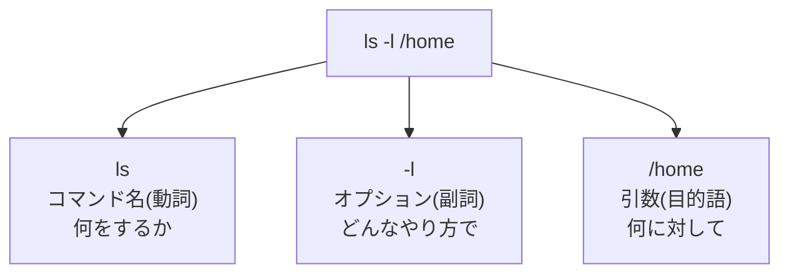

## このセクションで学ぶこと

- コマンドは「コマンド名・オプション・引数」の 3 要素でできた文として読めること
- オプションには短い形式(`-l`)と長い形式(`--help`)があること
- 要素どうしはスペースで区切るという、CLI でいちばん大事なルール

## コマンドは 3 つの部品でできている

黒い画面に打ち込む 1 行は、初めて見ると暗号のようですが、実は英語の命令文とよく似た構造を持っています。たとえば次のコマンドを見てください。

```bash
ls -l /home
```

これは 3 つの部品に分解できます。



- **コマンド名(`ls`)** — 「何をするか」を表す動詞です。`ls` は list の略で、「一覧を表示せよ」という意味になります。
- **オプション(`-l`)** — 動詞のやり方を変える副詞です。`-l` を付けると、一覧がサイズや更新日時つきの詳細表示に変わります。
- **引数(`/home`)** — 「何に対して」を表す目的語です。ここでは `/home` というディレクトリが対象になります。

つまり `ls -l /home` は「/home を、詳細形式で、一覧表示せよ」という 1 つの文です。前章で見たとおり、この文を読み取って実行するのがシェルの仕事でした。どんなに長く複雑に見えるコマンドでも、まず「動詞はどれか、修飾はどれか、目的語はどれか」と分解すれば、意味の見当がつくようになります。

## オプションには 2 つの書き方がある

オプションは必ずハイフンで始まりますが、形式が 2 種類あります。

- **短い形式**: ハイフン 1 つ+英字 1 文字。例 `-l`、`-a`
- **長い形式**: ハイフン 2 つ+単語。例 `--help`、`--all`

短い形式は素早く打てる代わりに意味が読み取りにくく、長い形式は打つ手間がかかる代わりに英単語なので意味がわかりやすい、という関係です。多くのコマンドでは同じ機能に両方の書き方が用意されていて、たとえば `ls -a` と `ls --all` は同じ「隠しファイルも含めて表示」を意味します。

また、短い形式はまとめて書けます。

```bash
ls -l -a    # オプションを 2 つ並べる
ls -la      # 上とまったく同じ意味
```

実務でよく見る `ls -la` は、`-l` と `-a` という 2 つのオプションを連結した形だった、というわけです。

## 区切りはスペース — いちばん大事なルール

3 つの要素は、**半角スペースで区切ります**。シェルは行の先頭の単語をコマンド名とみなし、残りをスペースで区切ってオプションや引数として受け取ります。だから `ls -l` を `ls-l` と詰めて書くと、シェルは「`ls-l` という名前のコマンド」を探してしまい、`command not found` というエラーになります。

逆に、スペースは 1 個でも 3 個でも同じ「区切り」として扱われるので、数を気にする必要はありません。大事なのは「要素の間には必ずスペースを置く」ことだけです。

## 注意点

- **オプションの意味はコマンドごとに違います**。`ls` の `-l` は「詳細表示」ですが、別のコマンドでは別の意味になることがあります。「`-l` = 詳細表示」と丸暗記せず、コマンドとセットで覚えてください。
- 引数を 2 つ以上とるコマンドもあります(コピー元とコピー先を指定する `cp` など)。3 要素の枠組み自体は変わらないので、落ち着いて分解すれば読めます。
- オプションを置く位置は、基本的に**コマンド名の直後**が無難です。コマンドによっては末尾でも動きますが、直後に置く癖をつけておけば迷いません。

## まとめ

- コマンドは「コマンド名(動詞)・オプション(副詞)・引数(目的語)」の 3 要素でできた文として読める
- オプションには `-l` のような短い形式と `--help` のような長い形式があり、短い形式は `-la` のように連結できる
- 要素の区切りは半角スペース。詰めて書くと別物として解釈されエラーになる
