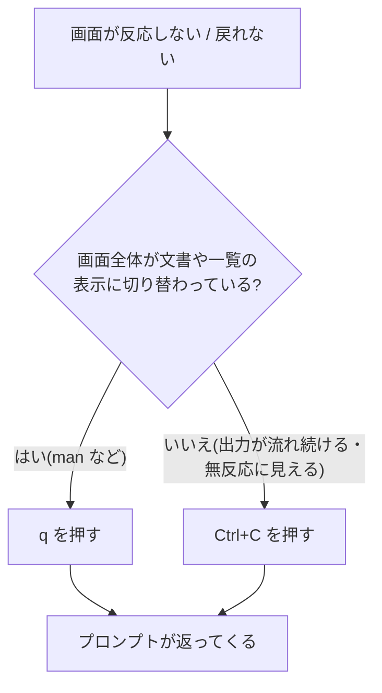

## このセクションで学ぶこと

- 「画面が固まった?」に見える状態の正体と、慌てなくてよい理由
- 実行中のコマンドを打ち切る `Ctrl+C` と、閲覧モードを閉じる `q` の使い分け
- 引用符の閉じ忘れで起きる「継続入力待ち」からの脱出

## 「固まった」のほとんどは故障ではない

CLI を使い始めた人が最初に焦るのが、「何か打ったら画面が反応しなくなった」という状態です。しかしその多くは故障ではなく、**こちらの入力をシェルやコマンドが待っているか、コマンドが延々と動き続けているか**のどちらかです。つまり、正しい「抜け方」さえ知っていれば怖くありません。代表的な脱出キーは 2 つだけ、`Ctrl+C` と `q` です。

## Ctrl+C — 実行中のコマンドを打ち切る

`Ctrl+C` は、Ctrl キーを押しながら C を押す操作で、**実行中のコマンドに「中断してほしい」と伝える**合図です。たとえば `ping` は、ネットワークの相手に応答確認を送り続けるコマンドで、放っておくと永遠に終わりません。

```bash
ping example.com
```

```text
64 bytes from 23.192.228.80: icmp_seq=1 ttl=53 time=110 ms
64 bytes from 23.192.228.80: icmp_seq=2 ttl=53 time=109 ms
...(延々と続く)
```

ここで `Ctrl+C` を押すと、コマンドが止まってプロンプトが返ってきます。プロンプトが表示された=シェルが次の命令を受け付ける状態に戻った、という合図でしたね。「終わらないコマンドは `Ctrl+C` で打ち切る」が脱出の基本形です。

なお、GUI の感覚で「Ctrl+C はコピー」と思っていると混乱しますが、**ターミナルの中では Ctrl+C は中断**です。コピーには通常、別のキー操作が割り当てられています。

## q — 閲覧モードを閉じる

前のセクションで触れたとおり、`man` のように画面全体が文書表示に切り替わるコマンドがあります。この状態(ページャ)では、文字を打っても命令としては解釈されません。ここからの脱出は `Ctrl+C` ではなく **`q`(quit)を 1 回押す**です。すると元の画面に戻り、プロンプトが返ってきます。

使い分けの目印は画面の見た目です。



迷ったら「まず `q`、だめなら `Ctrl+C`」の順で試すと安全です。

## > が出たら — 継続入力待ちからの脱出

もう 1 つ、よくあるのが**引用符の閉じ忘れ**です。たとえば `"` を 1 つだけ打って Enter すると、プロンプトが `>` に変わり、何を打っても実行されない状態になります。

```bash
echo "hello
>
```

これはシェルが「文がまだ閉じていないので、続きをどうぞ」と待っている**継続入力待ち**の状態です。続きを正しく入力してもよいのですが、初心者はいったん `Ctrl+C` で打ち切って、最初から打ち直すのが確実です。

## 注意点

- `Ctrl+C` は「取り消し」ではありません。**そこまでに実行された内容は元に戻らない**ので、途中まで進んだ処理が残ることがあります。
- 似たキーに `Ctrl+Z` がありますが、これは中断ではなく「一時停止」で、コマンドが裏に残ってしまいます。初心者のうちは脱出には使わないでください。
- どうしても抜けられないときは、ターミナルのウィンドウごと閉じて開き直しても構いません。それで壊れるものは(この段階では)ありません。

## まとめ

- 「固まった」の多くは入力待ちか実行継続中。正しい脱出キーを知っていれば怖くない
- 終わらないコマンドは `Ctrl+C` で中断、`man` などの全画面表示は `q` で閉じる
- プロンプトが `>` になったら継続入力待ち。`Ctrl+C` で打ち切って最初からやり直す
