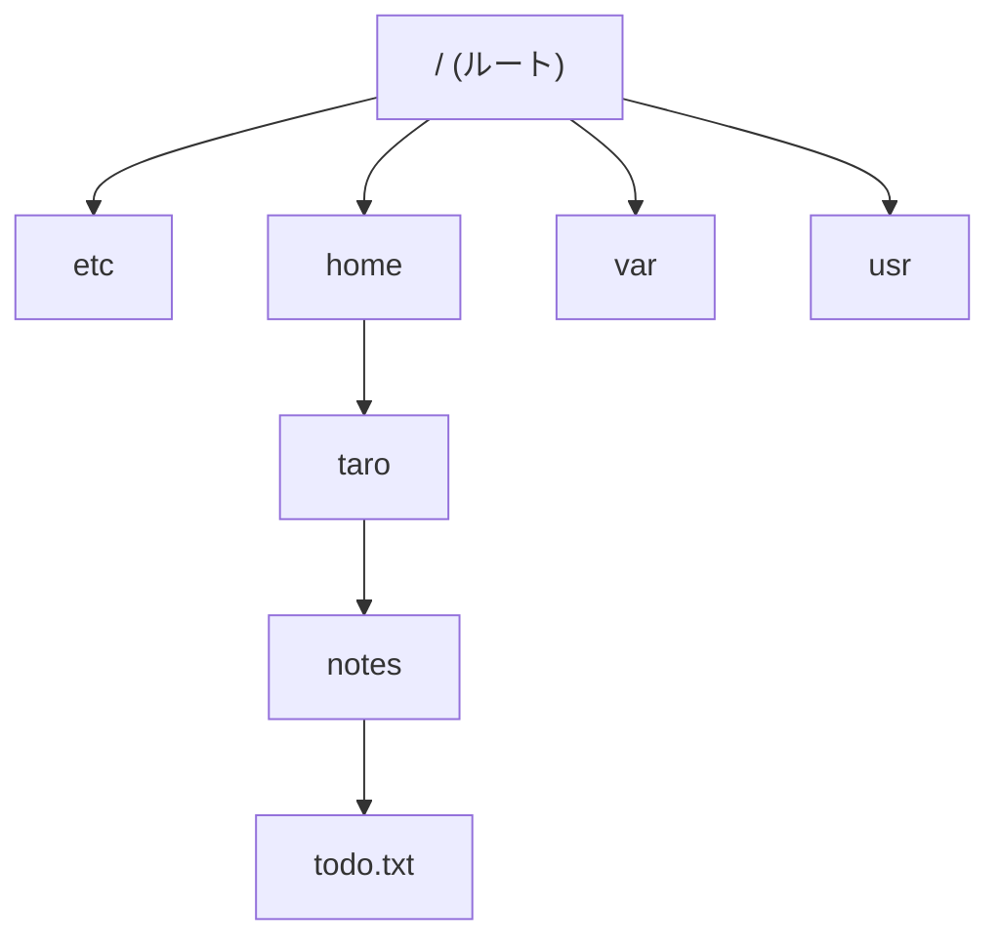

## このセクションで学ぶこと

- Linux のファイルシステムは、ルート(`/`)を頂点とする 1 本の木構造であることを理解する
- パスは「ファイルの住所」であり、階層を `/` で区切って左から右へ読めるようになる
- ドライブごとに木が分かれる Windows との発想の違いを知る

## ファイルシステムは 1 本の木

前の章では、`pwd` で現在地を確かめ、`cd` で移動する方法を学びました。では、その「移動している空間」は全体としてどんな形をしているのでしょうか。この章では、ファイルとディレクトリが収められている空間 — ファイルシステムの全体像を、地図として頭に入れていきます。

Linux のファイルシステムは、たった 1 つの頂点から枝分かれする木構造になっています。頂点にあるのがルートディレクトリで、スラッシュ 1 文字 `/` で表します。「根(root)」という名前のとおり、どのファイル・どのディレクトリも、上へ上へとたどっていけば必ず `/` に行き着きます。

木構造と聞くと難しそうですが、会社の組織図を思い浮かべてください。社長(`/`)の下に部(`/home` や `/etc`)があり、部の下に課があり、課の下に個々の社員(ファイル)がいる。上下のつながりが 1 本の系統にまとまっている、という形です。



## パスは「住所」

この木の中で特定の場所を指し示す文字列をパスと呼びます。書き方はシンプルで、ルートから順に、通り道になるディレクトリ名を `/` で区切って並べるだけです。

```
/home/taro/notes/todo.txt
```

これは「ルート直下の `home` の中の `taro` の中の `notes` の中にある `todo.txt`」という意味です。郵便の住所を「東京都 → 千代田区 → 1-1-1」と大きい区分から書くのと同じ要領で、パスも左から右へ、大きい階層から小さい階層へと読み進めます。先頭の `/` がルートを表し、それ以降の `/` は「区切り」を表している、という二役になっている点だけ少し注意してください。

実際に木の頂点をのぞいてみましょう。`ls` にパスを渡すと、その場所の中身を一覧できます。

```bash
$ ls /
bin  dev  etc  home  proc  tmp  usr  var ...
```

ここに並ぶディレクトリそれぞれの役割は 03-03 で見ていきます。今は「`/` の下にすべてがぶら下がっている」という形がつかめれば十分です。

## 注意点 — Windows の「ドライブ」とは発想が違う

Windows に慣れている人がつまずきやすいのが、ドライブの概念です。Windows では `C:\` や `D:\` のようにドライブごとに木が分かれ、頂点が複数あります。一方 Linux の頂点は常に `/` の 1 つだけです。USB メモリや外付けディスクをつないでも新しいドライブレターが生えるのではなく、木のどこか(たとえば `/media` の下)に枝として接ぎ木されます。これをマウントと呼びます。仕組みの詳細は今は不要で、「何をつないでも木は 1 本のまま」という前提だけ持っておけば、この先のパスの話がすっと読めます。

細かい違いも 2 つ押さえておきましょう。区切り文字は Windows のバックスラッシュ(`\`)に対して Linux はスラッシュ(`/`)です。また Linux は大文字と小文字を区別するため、`README.txt` と `readme.txt` は別のファイルです。パスは見たままを正確に写すのが基本です。

## まとめ

- Linux のファイルシステムは `/`(ルート)を頂点とする 1 本の木構造
- パスは住所のようなもので、階層を `/` で区切って左から右へ読む
- ドライブで木が分かれる Windows と違い、何をつないでも木は 1 本。大文字小文字も区別される
