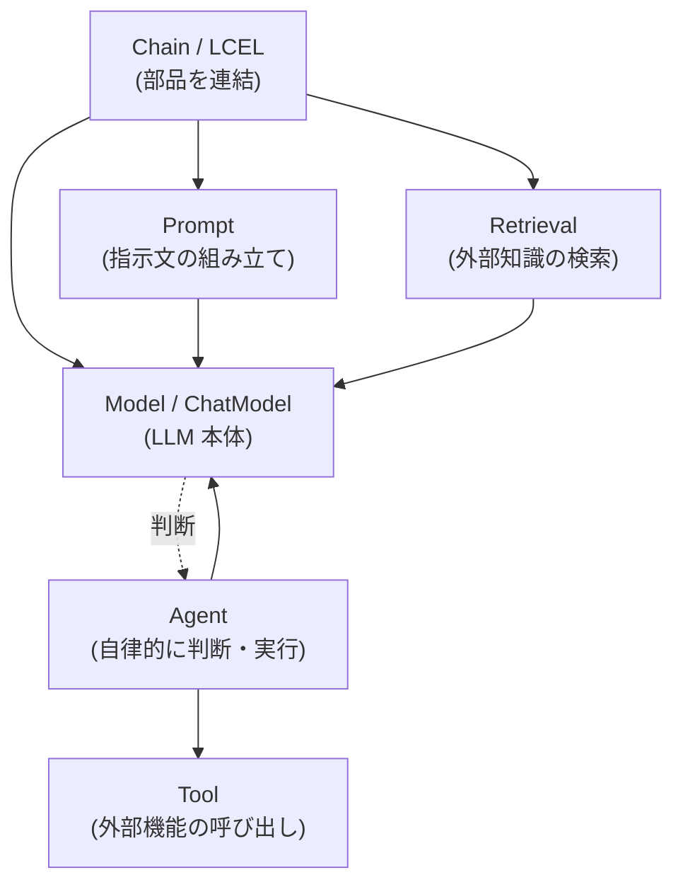

## このセクションで学ぶこと

- Model / Prompt / Chain / Retrieval / Tool / Agent の役割を一通り言える
- 各コンポーネントがどう組み合わさってアプリになるかをイメージできる
- どのコンポーネントがこの教材のどの章で深掘りされるかを把握する

## LangChain は「役割ごとの部品」の集まり

LangChain は巨大な一枚岩ではなく、役割の異なる部品(コンポーネント)を組み合わせて使う設計になっています。まずは代表的な 6 つを押さえれば、全体像はぐっと見通しやすくなります。それぞれが「LLM アプリのどの処理を担当するか」という観点で眺めてみましょう。

- **Model**: LLM 本体を抽象化した部品です。LangChain では会話形式の `ChatModel` が中心で、メッセージを渡すと応答が返ります。ベンダーが違っても同じ作法で扱えるのが利点です。
- **Prompt**: LLM への指示文をテンプレート化します。`{question}` のような変数を埋め込み、入力に応じてプロンプトを動的に組み立てられます。
- **Chain**: 複数の部品を連結し、一連の処理として実行します。新しい書き方である LCEL(LangChain Expression Language)では、`prompt | model | parser` のようにパイプ演算子でつなぎます。
- **Retrieval**: 外部文書から質問に関連する箇所を検索し、LLM に渡せる形にする部品群です。Embedding(ベクトル化)や VectorStore(ベクトル検索)を含み、RAG の中核を担います。
- **Tool**: LLM が呼び出せる外部機能です。電卓・Web 検索・社内 API など、LLM 単体ではできない操作を関数として登録します。
- **Agent**: LLM 自身に「次に何をすべきか」を判断させ、Tool の実行と結果の観測を繰り返して目標へ近づける仕組みです。自律的に動く点が Chain との大きな違いです。

## コンポーネントの関係を図で見る

これらは独立しているのではなく、Chain や Agent が他の部品を束ねる形で組み合わさります。Prompt と Model は最小の処理単位を作り、Retrieval は外部知識を、Tool は外部操作を供給し、Agent は Model に判断を委ねながらそれらを動かします。

図のように、Model はほぼすべての中心にいます。Chain は部品を線形につなぎ、Agent は Model の判断を起点に Tool を動的に呼び出す、という性格の違いがあります。

## 具体例:この部品立てがアプリにどう効くか

「社内文書 Q&A ボット」を例にすると、Prompt で回答の体裁を整え、Retrieval で関連文書を引き、Model に答えさせ、それらを Chain でつなぐ、という構成になります。さらに「在庫数を調べてから答える」など外部操作が必要なら、Tool と Agent を足します。要件が増えるほど、必要な部品を後付けできるのがコンポーネント設計の強みです。

## 注意点:全部を一度に使う必要はない

初学者がつまずきやすいのは「全コンポーネントを最初から使おうとする」ことです。実際には Model と Prompt だけで完結するアプリも多く、Retrieval や Agent は必要になってから足せば十分です。この教材でも、第 2 章で Model・Prompt・Chain、第 3 章で Retrieval、第 4 章で Tool・Agent と、段階的に深掘りしていきます。

## まとめ

- LangChain は Model / Prompt / Chain / Retrieval / Tool / Agent という役割別の部品の集まり。
- Model が中心にあり、Chain が線形連結、Agent が Model の判断で Tool を動かす点が対照的。
- 全部を一度に使う必要はなく、要件に応じて後付けできるのが設計上の強み。
