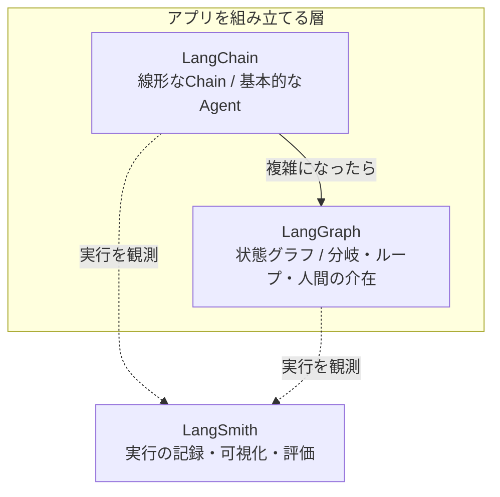

## このセクションで学ぶこと

- LangChain / LangGraph / LangSmith がそれぞれ何を担当するかを区別できる
- 三者の関係(連携・補完)をエコシステムとして俯瞰できる
- この教材のゴール(LangChain と LangGraph の使い分け)を見通す

## LangChain は単体ではなく「エコシステム」

LangChain を提供する企業は、LangChain 単体だけでなく、それを取り巻く複数のツールをまとめて開発しています。この一群を「LangChain エコシステム」と呼びます。よく一緒に語られるのが **LangGraph** と **LangSmith** です。名前が似ていて混同しやすいので、担当領域で整理しておきましょう。

- **LangChain**: LLM アプリを組み立てるための基盤ライブラリ。前のセクションで見た Model / Prompt / Chain などの部品を提供し、線形的な処理の連結(LCEL)や基本的な Agent を担います。
- **LangGraph**: 状態を持つグラフとしてワークフローを記述するライブラリ。分岐・ループ・途中での人間の承認といった「複雑な制御フロー」を得意とします。Chain や Agent では表現しづらくなった処理を、明示的なグラフとして書けます。
- **LangSmith**: アプリの実行を記録・可視化し、デバッグや評価を支援する観測プラットフォームです。「どのプロンプトで何が返り、どのステップに時間がかかったか」を追跡でき、LLM アプリ特有の見えにくさ(オブザーバビリティの低さ)を補います。

## 三者の位置づけを図で見る

LangChain と LangGraph は「アプリを組み立てる」役割で、用途の複雑さに応じて使い分けます。LangSmith はそれらの上から実行を観測する役割で、開発・運用を横断して支える存在です。

図のように、LangChain と LangGraph は連続した選択肢として並び、LangSmith はどちらの実行も横断的に観測します。三者は競合ではなく補完関係にある点がポイントです。

## 具体例:複雑さが増したときの移行イメージ

最初は LangChain の Chain で「検索 → 回答」を組んでいたアプリが、やがて「回答が不十分なら検索し直す」「危険な操作の前に人間の承認を挟む」といった要件を抱えたとします。こうしたループや分岐、人間の介在は LangChain の線形なチェーンでは表現が苦しくなり、LangGraph の出番になります。一方で、どの段階でも LangSmith を入れておけば、実行ログを見ながら問題箇所を特定できます。

## 注意点:いきなり全部を導入しない

初学者が「エコシステム全部を使わなければ」と気負う必要はありません。学習や小規模開発の段階では LangChain だけで十分なことが多く、LangGraph は制御が複雑化してから、LangSmith はデバッグや評価が必要になってから足すのが現実的です。なお、この教材の最終章では「どこからが LangGraph の領域か」という境界線の引き方を扱います。本章はその前提となる全体像の把握が目的です。

## まとめ

- LangChain はアプリ基盤、LangGraph は複雑な制御フロー、LangSmith は実行の観測を担当する。
- 三者は競合ではなく補完関係で、複雑さや運用ニーズに応じて段階的に足していく。
- LangChain と LangGraph の使い分けは、この教材の最終章で詳しく扱う。
