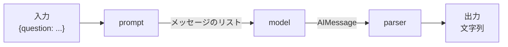

## このセクションで学ぶこと

- LCEL のパイプ演算子で prompt | model | parser を 1 つのチェーンに連結できる
- Runnable が invoke / stream / batch という共通インターフェースを持つことを理解する
- チェーン全体が 1 つの Runnable として振る舞う合成のしくみを把握する

## LCEL でコンポーネントをパイプ連結する

ここまでで PromptTemplate と ChatModel を別々に使ってきました。これらを **明示的に手で受け渡しせず、宣言的につなぐ** のが LCEL(LangChain Expression Language)です。LCEL では Python のパイプ演算子 `|` を使い、前の出力を次の入力に流し込みます。

```python
from langchain_openai import ChatOpenAI
from langchain_core.prompts import ChatPromptTemplate
from langchain_core.output_parsers import StrOutputParser

prompt = ChatPromptTemplate.from_messages([
    ("system", "あなたは簡潔に答えるアシスタントです。"),
    ("human", "{question}"),
])
model = ChatOpenAI(model="gpt-4o-mini", temperature=0)
parser = StrOutputParser()  # AIMessage から文字列を取り出す

chain = prompt | model | parser

answer = chain.invoke({"question": "LCEL とは何ですか?"})
print(answer)  # 文字列がそのまま返る
```

`prompt | model | parser` という 1 行が、「変数を埋める → モデルに渡す → 応答を文字列にする」という一連の流れを表します。`chain.invoke({...})` を呼ぶと、入力辞書が prompt に渡り、その出力が model へ、さらに parser へと自動で流れます。手続き的に中間変数を書き並べる必要がなく、データの流れが読みやすくなります。



## すべては Runnable という共通の部品

なぜ異なる種類のコンポーネントを `|` でつなげるのでしょうか。それは、prompt も model も parser も、そしてそれらを連結したチェーン自身も、すべて **Runnable** という同じ抽象を実装しているからです。Runnable は次の共通メソッドを持ちます。

- **invoke(input)**: 入力 1 件を処理して結果を返す(同期・単発)。
- **stream(input)**: 結果を少しずつ(トークン単位など)逐次返す。チャット UI の逐次表示に使う。
- **batch(inputs)**: 複数入力をまとめて処理する。内部で並列化され、大量処理に向く。

```python
# 同じ chain を 3 通りの呼び方で使える
chain.invoke({"question": "Q1"})
for chunk in chain.stream({"question": "Q2"}):
    print(chunk, end="")
chain.batch([{"question": "Q1"}, {"question": "Q2"}])
```

重要なのは、`prompt | model | parser` の結果もまた 1 つの Runnable だという点です。つまりチェーンを別のチェーンの部品として埋め込んだり、さらに大きなパイプの一部にしたりできます。この **合成可能性(composability)** が LCEL の核心です。

## 注意点

パイプは左から右へ「前の出力 = 次の入力」で流れるので、隣り合うコンポーネントの入出力の型が噛み合っている必要があります。たとえば model の出力は AIMessage なので、その後ろには AIMessage を受け取れる parser を置きます。型が合わないと実行時にエラーになります。また、`stream` が真価を発揮するのはモデルの逐次出力であり、間に「全体が揃わないと処理できない」ステップを挟むとストリーミングが途切れる点にも注意しましょう。

## まとめ

- LCEL はパイプ演算子で prompt | model | parser を宣言的に連結する記法。
- 連結できる部品はすべて Runnable で、invoke / stream / batch の共通インターフェースを持つ。
- チェーン全体も 1 つの Runnable になり、さらに大きなチェーンへ合成できる。
