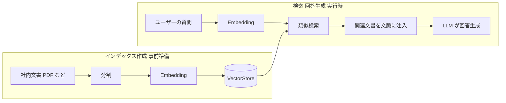

## このセクションで学ぶこと

- LLM が抱える「知識の鮮度」と「ハルシネーション」の課題を説明できる
- RAG(検索拡張生成)が外部知識を文脈として注入する仕組みを理解する
- RAG のパイプライン(インデックス作成と検索・回答生成)の全体像を俯瞰できる

## LLM 単体では答えられないこと

ChatModel に質問すれば、たいていそれらしい答えが返ってきます。しかし業務で使おうとすると、すぐに二つの壁にぶつかります。

一つ目は **知識の鮮度** です。LLM はある時点までの学習データで止まっており、それ以降の出来事や、そもそも学習データに含まれていない社内ドキュメント・製品マニュアル・最新の社内規程は知りません。「弊社の最新の経費精算ルールは?」と聞いても、モデルは正しく答えようがないのです。

二つ目は **ハルシネーション** です。LLM は「知らない」と言うより、もっともらしい嘘を流暢に生成してしまう傾向があります。根拠を持たないまま回答するため、事実確認のできない情報が混ざり込みます。たとえば社内サポートのチャットボットが、存在しない手続きや誤った締め日を自信満々に答えてしまえば、利用者はそれを信じて動いてしまいます。正確性が求められる業務ほど、この性質は見過ごせないリスクになります。

「ならばモデルを自社データで学習させ直せばよいのでは」と考えるかもしれません。しかしファインチューニングは計算コストが高く、文書が更新されるたびに学習をやり直す必要があり、運用負荷が大きくなりがちです。日々増え続ける社内ドキュメントに追従するには現実的とは言えません。

## RAG という解き方

これらを解決するのが **RAG(Retrieval-Augmented Generation、検索拡張生成)** です。発想はシンプルで、「LLM に記憶させる」のではなく「答えるときに必要な資料を渡す」という考え方です。

具体的には、ユーザーの質問に関連する文書をあらかじめ用意したデータベースから検索し、その本文をプロンプトに添えて「この資料に基づいて答えてください」と指示します。回答が与えた資料という根拠に縛られるため、これを **グラウンディング** と呼びます。

RAG は大きく二つのフェーズに分かれます。事前に文書を検索可能な形にしておく **インデックス作成** と、質問が来たときに検索して回答を生成する **検索・回答生成** です。

## 注意点

RAG は万能ではありません。検索でズレた文書を拾えば、LLM はそのズレた資料に従って誤答します。「検索の精度」がそのまま回答品質を左右する点が、後続セクションで分割や Embedding を丁寧に扱う理由です。また、モデルに渡せる文脈量(コンテキスト長)には上限があるため、関連文書を無制限に詰め込めるわけではありません。

## まとめ

- LLM 単体は知識の鮮度とハルシネーションという課題を抱える
- RAG は質問に関連する文書を検索し、文脈として渡して回答を根拠づける
- RAG はインデックス作成と検索・回答生成の二つのフェーズで構成される
