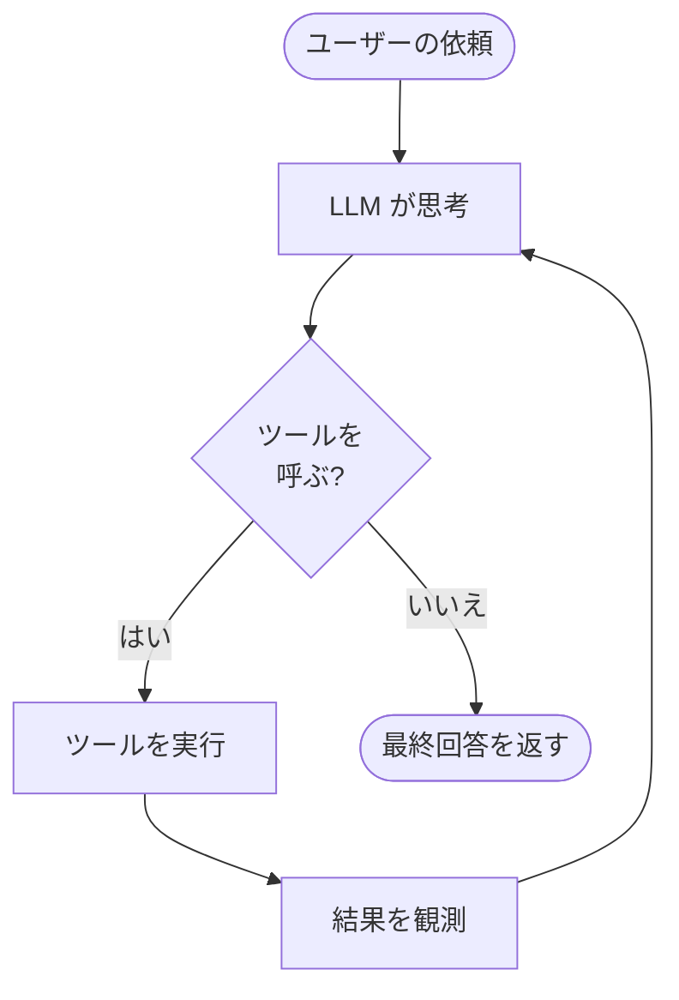

## このセクションで学ぶこと

- Agent が「思考 → ツール実行 → 観測」のループを自律的に繰り返す仕組みを理解する
- ループの終了条件(LLM がツールを呼ばなくなったら完了)を説明できる
- LangChain で簡単な Agent を構成する基本形を把握する

## Agent は往復を「自分で」回し続ける

前のセクションで見た「要求 → 実行 → 結果を戻す」の往復を、人間が手で書く代わりに **自動で繰り返す**のが Agent です。Agent は LLM を頭脳として、次の 3 ステップをループします。

- **思考(reasoning)**: LLM が「目標達成のために次に何をすべきか」を考え、必要なら tool call を出す。
- **ツール実行(action)**: 要求されたツールをアプリ側が実行する。
- **観測(observation)**: 実行結果を LLM に戻し、次の思考の材料にする。

重要なのは、何回ツールを呼ぶか・どの順で呼ぶかを **事前に決めない**点です。Chain(第 2 章)が「あらかじめ決めた順序でデータを流す」固定的な処理だったのに対し、Agent は **状況に応じて経路を自分で決める**。ここが Agent の本質です。

## ループの図解



終了条件はシンプルです。**LLM がもうツールを呼ばず、最終的な回答だけを返したとき**にループは終わります。たとえば「東京と大阪、どちらが暖かい?」という依頼なら、Agent は天気ツールを 2 回呼んで両方の気温を観測し、それらを比較した回答を生成してループを抜けます。

## LangChain での基本形

LangChain には Agent ループを内部で回してくれる仕組みが用意されています。ツール群と LLM を渡すと、上の図のループを自動で実行します。

```python
from langgraph.prebuilt import create_react_agent
from langchain_openai import ChatOpenAI

llm = ChatOpenAI(model="gpt-4o-mini")
agent = create_react_agent(llm, tools=[get_weather])

result = agent.invoke(
    {"messages": [("user", "東京と大阪、どちらが暖かいですか?")]}
)
print(result["messages"][-1].content)
```

この一行の `invoke` の裏で、「思考 → 天気ツール実行 → 観測」が必要なだけ繰り返されています。

## 注意点: 自律性は諸刃の剣

Agent の「自分で経路を決める」性質は強力ですが、裏を返せば **何回ループするか・いくらコストがかかるかを事前に読みにくい**ということです。ツール選択を誤ったまま延々とループし続けることもあり得ます。この制御の難しさが次のセクションのテーマです。

## まとめ

- Agent は「思考 → ツール実行 → 観測」を自律的にループし、経路を自分で決める。
- LLM がツールを呼ばず最終回答を返した時点でループが終了する。
- 自律性は強力だが、ループ回数やコストを事前に読みにくいという裏返しがある。
