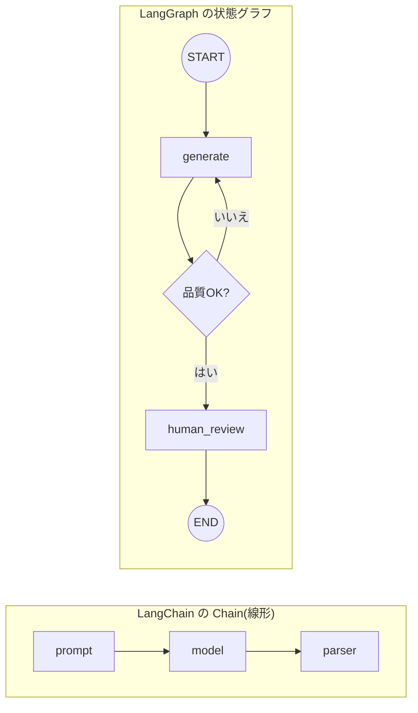

## このセクションで学ぶこと

- LangGraph が「状態(State)」「ノード」「エッジ」でアプリを記述することを理解する
- 条件付きエッジによってループや分岐を明示的に書けることを押さえる
- 線形な Chain と状態グラフの構造の違いを図でつかむ

## LangGraph は「状態を持つグラフ」

**LangGraph** は、LLM アプリの処理を **状態を持つグラフ(state graph)** として記述するフレームワークです。前のセクションで見た「状態・分岐・ループ・人間の介在」を、最初から扱えるように設計されています。登場人物は 3 つだけです。

- **State(状態)**: グラフ全体で共有される中央のデータです。会話履歴・中間結果・残タスクなどをここに溜めていきます。
- **ノード(Node)**: 状態を受け取り、更新した状態を返す関数です。LLM 呼び出しやツール実行など、1 つの処理単位を担います。
- **エッジ(Edge)**: ノードからノードへの接続です。固定の接続のほか、状態を見て行き先を決める **条件付きエッジ** を引けます。

つまり LangGraph では、「どんなデータを持ち回るか(State)」「どんな処理をするか(Node)」「次にどこへ進むか(Edge)」を**自分で明示的に組み立てる**のがポイントです。Agent のように LLM 任せにするのではなく、流れの骨格は開発者が設計します。

## 線形な Chain と状態グラフの違い

LCEL の Chain が一直線だったのに対し、LangGraph のグラフは**前のノードへ戻る矢印(ループ)や、条件による枝分かれ**を持てます。両者の構造を比べてみましょう。



左の Chain は入口から出口まで一方向ですが、右のグラフは「品質チェックで NG なら `generate` に戻る」というループや、「人間のレビューを挟む」ノードを自然に書けています。State がグラフ全体で共有されているので、`generate` が作った中間結果を `human_review` がそのまま参照できる点も Chain との大きな違いです。

## 簡単な例で構造をつかむ

コードのイメージは次のとおりです。詳細は LangGraph 編で扱うので、ここでは「State を定義し、ノードを追加し、エッジでつなぐ」という流れだけ押さえてください。

```python
from langgraph.graph import StateGraph, START, END

graph = StateGraph(MyState)            # 状態の型を渡す
graph.add_node("generate", generate)   # ノード(関数)を登録
graph.add_node("review", review)
graph.add_edge(START, "generate")      # 固定エッジ
graph.add_conditional_edges(           # 条件付きエッジ(分岐・ループ)
    "generate", route, {"retry": "generate", "ok": "review"}
)
graph.add_edge("review", END)
app = graph.compile()
```

注意点として、LangGraph は LangChain を**置き換えるものではなく上に乗るもの**です。各ノードの中身は、第 2 章の LCEL チェーンや第 4 章のツールをそのまま使えます。LangGraph はあくまで「それらをどうつなぎ、どんな状態で動かすか」という**制御の骨格**を提供する層だと理解してください。

## まとめ

- LangGraph は State・ノード・エッジでアプリを記述する「状態を持つグラフ」です。
- 条件付きエッジによって、分岐やループ・人間の介在を明示的に書けます。
- LangChain を置き換えるのではなく、その上に制御の骨格を載せる層です。
