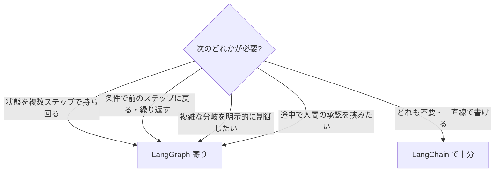

## このセクションで学ぶこと

- LangChain と LangGraph の設計思想・制御性・適性を項目ごとに比較できる
- 「状態・分岐・ループ・人間の介在」が境界線の判断軸になることを理解する
- 両者は対立ではなく役割分担(レイヤーの違い)であることを押さえる

## 項目ごとの比較

ここまでの内容を、観点ごとに表で整理します。LangChain は「コンポーネントをつなぐ部品とパイプ」、LangGraph は「それらを動かす制御の骨格」という役割分担で見ると理解しやすくなります。

| 観点 | LangChain(Chain / Agent) | LangGraph(状態グラフ) |
| --- | --- | --- |
| 基本構造 | 線形なパイプ(LCEL)/ LLM 任せのループ(Agent) | State・ノード・エッジのグラフ |
| 流れの決め方 | 一方向、または LLM が自律的に決定 | 開発者が明示的に設計(条件付きエッジ) |
| 状態の保持 | チェーン内で持ち回るのは苦手 | State に集約して全ノードで共有 |
| ループ・分岐 | 限定的(RunnableBranch 等) | 得意(条件付きエッジで自然に表現) |
| 人間の介在 | 差し込みにくい | チェックポイントで中断・再開できる |
| 制御性 | Chain は高い / Agent は低い | 高い(骨格を自分で書く) |
| 向く規模 | 単純な変換・短い自律処理 | 状態を持つ複雑なワークフロー |

ポイントは、Chain は「制御性が高いが柔軟性が低い」、Agent は「柔軟性が高いが制御性が低い」のに対し、**LangGraph は柔軟性と制御性の両立を狙う**位置にいることです。

## 境界線をどこに引くか

「いつ LangGraph に移すべきか」の判断軸は、第 1 セクションで挙げた 4 つに集約されます。次のいずれかに当てはまり始めたら、LangGraph を検討する合図です。

逆に言えば、**これらが不要なら無理に LangGraph を使う必要はありません**。単純な要約・翻訳・1 回限りの RAG 質問応答などは、LCEL の Chain のほうがコードが短く読みやすく、メンテナンスも楽です。複雑なフレームワークを使うこと自体が目的化しないよう注意してください。

## 対立ではなく役割分担

最後に強調したいのは、両者は **どちらかを選んで他方を捨てるものではない** という点です。前のセクションで見たとおり、LangGraph の各ノードの中身は LangChain の ChatModel・LCEL チェーン・ツールでできています。実務では「全体の制御フローは LangGraph で組み、個々の処理は LangChain の部品で実装する」という**組み合わせ**が王道です。

注意点として、両者はバージョンの進化が速く、API 名や推奨スタイルが変わることがあります。比較表の細部より、「**部品とパイプの LangChain、制御の骨格の LangGraph**」という役割の違いを軸に覚えておくと、バージョンが変わっても判断を誤りません。

## まとめ

- LangChain は部品とパイプ、LangGraph は状態を持つ制御の骨格、という役割分担です。
- 状態・ループ・複雑な分岐・人間の介在が必要になったら LangGraph を検討します。
- 両者は対立ではなく組み合わせて使うもので、不要なら LangChain だけで十分です。
